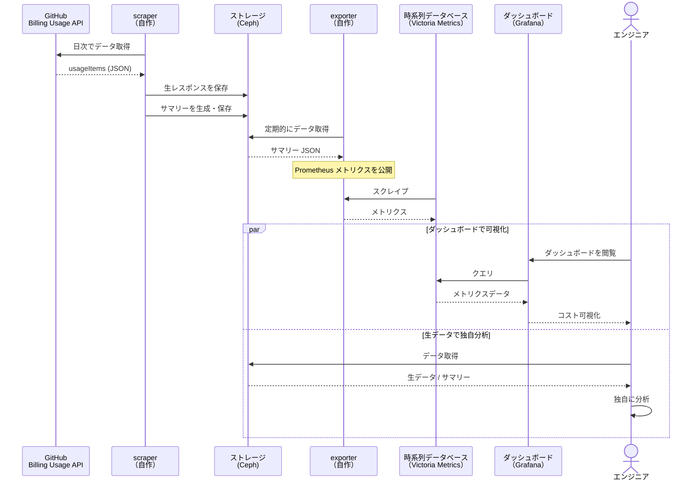

こんにちは。サイボウズ株式会社、[生産性向上チーム](https://www.docswell.com/s/cybozu-tech/5R2X3N-engineering-productivity-team-recruitment-information)の平木場（[@korosuke613](https://korosuke613.dev)）です。

GitHub.com をお使いの皆さん、従量課金のコスト分析に課題を感じていないでしょうか。GitHub Actions、Copilot、Packages、Codespaces などのサービスが増えるにつれて、「どの Organization のどのリポジトリで、どの SKU[^sku] にいくらかかっているか」を正確に把握するのは難しくなってくるのではと思います。

GitHub には [Enhanced Billing Platform](https://docs.github.com/en/enterprise-cloud@latest/billing/using-the-enhanced-billing-platform-for-enterprises/about-the-enhanced-billing-platform-for-enterprises) という従量課金管理の仕組みがあり、その一環である **Billing Usage API を通じてプログラマティックにコストデータを取得できます**。Billing Usage API を活用すれば、Organization/リポジトリ/SKU 別の詳細分析、時系列での推移追跡、割引前後の比較といった高度な分析が可能です。

本記事では、GitHub.com の利用者を対象に Billing Usage API の詳細を解説し、実践的な応用例として Billing Usage API を活用したコスト分析ダッシュボードを紹介します。

なお、**筆者は GitHub Enterprise Cloud を利用しているため、本記事では Enterprise レベルの API を紹介する内容となっています**。同様に、[Organization レベルの API](https://docs.github.com/en/rest/billing/usage?apiVersion=2022-11-28#get-billing-usage-report-for-an-organization)、[User レベルの API](https://docs.github.com/en/rest/billing/usage?apiVersion=2022-11-28#get-billing-usage-report-for-a-user) も提供されていますが、詳細な仕様については各ドキュメントを参照してください。


*Billing Usage API を活用することでこんな感じのダッシュボードも作れます（中の情報は全てダミーです）*

:::message
**想定読者**

- GitHub の Enterprise、Organization 管理者
- GitHub の利用料金を Organization/リポジトリ/SKU 単位で把握・分析したい人
- Billing Usage API を使って課金データをプログラマティックに扱いたい人
:::

# Billing Usage API とは
Billing Usage API の概要を説明します。

## 背景 - 管理画面の課題と API の必要性

GitHub Enterprise Cloud では、GitHub Actions の実行時間、Copilot のシート、Packages のストレージ、Codespaces の利用など、さまざまなサービスが従量課金で提供されています。組織の規模が大きくなると、これらのコストが無視できない金額になってきます。

Enterprise の管理画面には利用料を確認できる簡単なダッシュボード（`Billing and licensing` -> `Usage` -> `Metered usage`）があり、ある程度の情報は確認できます。


*https://github.blog/changelog/2024-09-24-enhanced-billing-platform-for-enterprises/ より*

しかし、管理画面だけでは次のような課題があります。

- **Organization やリポジトリ単位の内訳が見づらい**: 管理画面では全体の合計は確認できるものの、どの Organization のどのリポジトリで特にコストが発生しているかを横断的に分析するのが難しい
- **時間範囲を柔軟に設定できない**: Timeframe が「Current month」「Last month」「This year」「Last year」の 4 種類しかなく、特定の日付範囲での分析ができない
- **複数の要素を組み合わせた可視化をするのが困難**: 特定種類（Product, SKU, Repository, Organization, Cost center）でのグルーピング、クエリによるフィルタリングはできるが、組み合わせによってできる場合とできない場合があり、例えば「Actions Linux の Organization 別利用量」を可視化するようなことができない
- **閲覧に Enterprise Admin 権限が必要**: 管理画面の Billing ページは Enterprise Admin しかアクセスできないため、社内のエンジニアが自主的にコスト状況を確認して改善に取り組むことが難しい

Enhanced Billing Platform の管理画面から CSV をダウンロードして分析することも可能ですが、定期的な分析やダッシュボード化には手作業が多く、正直やってられません。

## Billing Usage API でできること

GitHub からは Enhanced Billing Platform の一部としてあらゆる課金情報が取れる Billing Usage API が提供されています（[ロードマップ](https://github.com/github/roadmap/issues/246)）。Public Preview を経て、2024 年に [Enhanced Billing Platform が全 Enterprise に展開](https://github.blog/changelog/2024-09-24-enhanced-billing-platform-for-enterprises/)されたことで広く利用可能になりました[^before_api]。Billing Usage API（`GET /enterprises/{enterprise}/settings/billing/usage`）を使うと、次のことが可能になります。

[^before_api]: [以前は GitHub Actions と Packages の個別 API](https://github.com/github/roadmap/issues/60)（`GET /enterprises/{enterprise}/settings/billing/actions` などを使うことでそれらの分析も可能でしたが、すべてのランナー種類（M1 Mac 等の新しいランナーなど）が反映されなかったり、Actions と Packages 以外のコストがわからなかったりと限定的な分析しかできませんでした。なお、これらの個別 API は [2025 年 9 月に廃止されています](https://github.blog/changelog/2025-09-26-product-specific-billing-apis-are-closing-down/)。

- **Organization/リポジトリ/SKU 別の詳細な内訳分析**: どの Organization のどのリポジトリで、どの SKU（ランナー種類やサービス）にいくらかかっているかを一括取得できる
- **時系列での推移追跡と将来予測**: API から取得したデータを時系列データベースに蓄積すれば、コストの増減をグラフ化できるだけでなく、トレンドに基づいた将来のコスト予測も可能になる
- **割引前後の料金比較**: `grossAmount`（割引前）と `netAmount`（割引後）の両方が取得できるため、プランに含まれる無料枠や割引の効果を可視化できる
- **プログラマティックな分析と集計**: CSV ダウンロードではなく API 経由でデータを取得できるため、自動集計やアラート設定、他システムとの連携が可能になる

このように Billing Usage API を活用すれば、GitHub.com の管理画面だけでは難しかった高度なコスト分析が実現できます。本記事の後半では、この API を活用した応用例として構築したコスト可視化＆分析ダッシュボードを紹介します。

ちなみに、GitHub のドキュメントには Billing Usage API を使って使用料レポートを自動生成するチュートリアルがあります。こちらも参考になるでしょう。

- [Automating usage reporting with the REST API - GitHub Docs](https://docs.github.com/en/billing/tutorials/automate-usage-reporting)

# Billing Usage API 詳細

ここからは Billing Usage API の技術的な詳細を解説します。
ドキュメントは [Get billing usage report for an enterprise](https://docs.github.com/en/enterprise-cloud@latest/rest/billing/usage#get-billing-usage-report-for-an-enterprise) になります[^org_user_level]。

[^org_user_level]: Organization レベルの API は [Get billing usage report for an organization](https://docs.github.com/en/rest/billing/usage?apiVersion=2022-11-28#get-billing-usage-report-for-an-organization)、User レベルの API は [Get billing usage report for a user](https://docs.github.com/en/rest/billing/usage?apiVersion=2022-11-28#get-billing-usage-report-for-a-user) になります

## エンドポイント

```
GET /enterprises/{enterprise}/settings/billing/usage
```

:::message
なお、[Get billing usage summary for an enterprise](https://docs.github.com/en/enterprise-cloud@latest/rest/billing/usage?apiVersion=2022-11-28#get-billing-usage-summary-for-an-enterprise)（`GET
/enterprises/{enterprise}/settings/billing/usage/summary`）という API も存在します。こちらは日、月、年、Organization、リポジトリ、プロダクト、SKU を絞り込んでサマリーを取得できる API になります。[2025 年 11 月にパブリックプレビューとして発表](https://github.blog/changelog/2025-11-03-manage-budgets-and-track-usage-with-new-billing-api-updates/)されたもので、2026/02/10 時点でもパブリックプレビューとなっています。
:::

## リクエスト

Billing Usage API では、次の 3 つのパラメータで取得対象の日を指定します。いずれもオプションで、省略した場合は現在の UTC 日付がデフォルト値として使用されます。

- `year`: 西暦（例: 2025）。デフォルト: 現在の年
- `month`: 月（1 から 12）。デフォルト: 現在の月
- `day`: 日（1 から 31）。デフォルト: 現在の日

日付は UTC 基準で解釈されます。例えば `year=2025&month=1&day=15` を指定すると、2025 年 1 月 15 日の 00:00:00 UTC から 23:59:59 UTC までの 24 時間分のデータが取得対象となります。なお、取得可能なデータは過去 24 ヶ月分に限定されています。それより古い日付を指定した場合、空のレスポンスが返されます。

なお、`cost_center_id` パラメータでコストセンター別にデータを絞り込むことも可能ですが、本記事では割愛します。

:::message
以前は `hour` パラメータも受け付けており、時間単位でデータを取得できましたが、ある時点で廃止され[^hour_deprecation]、現在は日単位でのデータ取得のみとなります。ただし、レスポンスの各 `usageItem` はイベント単位のデータであり、`date` フィールドには課金イベント発生時刻が含まれています。そのため、API のリクエストは日単位ですが、取得したデータをクライアント側で時間ごとに集計できます。

[^hour_deprecation]: > Usage report API changes: We’ve removed the hour parameter from the existing usage report API and reduced the granularity of the response when using the day parameter to provide daily totals instead of hourly breakdowns. <br />https://github.blog/changelog/2025-11-03-manage-budgets-and-track-usage-with-new-billing-api-updates/#additional-improvements 
:::

[^sku]: SKU（Stock Keeping Unit）は課金単位の区分を指します。Billing Usage API では `Actions Linux`、`Actions macOS 3-core`、`Copilot Business` のようにサービスの種類や規模ごとに SKU が定義されています。

## レスポンス

API レスポンスは `usageItems` 配列を含む JSON です。各アイテムには課金に関する詳細情報が含まれています。次のサンプルは Actions、Copilot、Codespaces の利用料金データの例です。

```json:レスポンス例（値はダミーです）
{
  "usageItems": [
    {
      "date": "2025-10-15T01:12:28Z",
      "product": "actions",
      "sku": "Actions Linux",
      "quantity": 3,
      "unitType": "Minutes",
      "pricePerUnit": 0.006,
      "grossAmount": 0.018,
      "discountAmount": 0.018,
      "netAmount": 0,
      "organizationName": "my-org",
      "repositoryName": "my-repo-a"
    },
    {
      "date": "2025-10-15T01:34:34Z",
      "product": "copilot",
      "sku": "Copilot Business",
      "quantity": 0.249999995,
      "unitType": "UserMonths",
      "pricePerUnit": 19,
      "grossAmount": 4.749999905,
      "discountAmount": 0,
      "netAmount": 4.749999905,
      "organizationName": "my-org",
      "repositoryName": ""
    },
    {
      "date": "2025-10-16T00:00:00Z",
      "product": "codespaces",
      "sku": "Codespaces prebuild storage",
      "quantity": 7.234838112,
      "unitType": "GigabyteHours",
      "pricePerUnit": 0.07,
      "grossAmount": 0.506438496,
      "discountAmount": 0,
      "netAmount": 0.506438496,
      "organizationName": "my-org",
      "repositoryName": "my-repo-c"
    }
  ]
}
```

各フィールドの説明は次の通りです。

| フィールド | 説明 |
|---|---|
| `date` | 使用が発生した日時（ISO 8601 形式、UTC） |
| `product` | サービス名（`actions`、`copilot`、`packages`、`codespaces`、`sharedStorage` など） |
| `sku` | 料金区分。`Actions macOS 3-core`、`Actions Windows`、`Copilot Premium Request`、`Packages storage` など、サービスの種類や規模ごとに定義される |
| `quantity` | 使用量。`unitType` に応じた単位で表される |
| `unitType` | 使用量の単位（`Minutes`、`GigabyteMonths` など） |
| `pricePerUnit` | 単位あたりの単価（USD） |
| `grossAmount` | 割引前の料金（USD）。`quantity * pricePerUnit` で算出される |
| `discountAmount` | 割引額（USD） |
| `netAmount` | 割引後の料金（USD）。`grossAmount - discountAmount` |
| `organizationName` | Organization 名 |
| `repositoryName` | リポジトリ名 |

:::message
`grossAmount` と `netAmount` の違いは、プランに含まれる無料枠や割引が適用されているかどうかです。割引がない場合は `discountAmount` が 0 となり、`grossAmount` と `netAmount` は同じ値になります。無料枠内の利用では `netAmount` が 0 になることもあります。後述する独自のコスト可視化・分析ダッシュボードでは両方のメトリクスを公開し、実質的なコストと定価ベースのコストの両方を可視化できるようにしています。
:::

## 認証方法

この API を利用するには、Personal Access Token（Classic）が必要です。PAT Classic 作成画面で `admin:enterprise` 配下の `manage_billing:enterprise` スコープを選択してください。

:::message alert
**GitHub App / Fine-grained PAT について**
この API は GitHub App では利用できません。2026 年 2 月 10 日時点で、Enterprise スコープの `manage_billing` 権限は GitHub App に付与できないため、Personal Access Token（Classic）を使用する必要があります。Fine-grained PAT でも Enterprise の billing 権限は未対応です。

GitHub App が使えれば短命トークンで運用でき、セキュリティ的にも望ましいのですが、現状ではユーザーにひもづく長命な PAT を安全に管理する必要があります。なお、Enterprise API 自体は GitHub App / Fine-grained PAT 対応は [GitHub のロードマップ](https://github.com/github/roadmap/issues/793)上では Public Preview となっており、Enterprise GitHub App ではすでに一部の Enterprise API を実行可能です。しかし、Enterprise Billing Usage API を実行できるスコープはまだ提供されていません。早く GitHub App 対応してほしいですね...。
:::

# 応用編 - コスト可視化・分析ダッシュボードの構築

Billing Usage API から取得したデータは JSON 形式のため、さまざまな方法で集計・分析できます。シンプルな方法としてはスプレッドシート（Google Sheets や Excel）への取り込み、より高度な分析には BigQuery や Snowflake などのデータウェアハウスへの投入も考えられます。

筆者は S3 互換ストレージ（Ceph）+ Victoria Metrics + Grafana を組み合わせてコスト可視化・分析システムを構築しました（社内限定）。ぶっちゃけた話、社内 Kubernetes 基盤にこれらのコンポーネントがすでに用意されていたため、追加のインフラコストなしで構築できたのが決め手です。本節では、このアーキテクチャを使った実装例を紹介します。

## システム構成

システムのデータフローは次の通りです。Ceph（S3 互換ストレージ）、Victoria Metrics、Grafana はサイボウズの社内 Kubernetes 基盤 [Neco](https://blog.cybozu.io/entry/2025/04/11/112000) にあらかじめ用意されています。



## メトリクス設計

API レスポンスに含まれる `usageItems` は個々の課金イベント単位であり、それぞれに課金イベント発生時刻の timestamp が含まれています。そのままではデータ量が膨大になるため、scraper が `usageItems` を timestamp に基づいて 1 時間単位にサマリー化し、同じ `product`/`sku`/`organizationName`/`repositoryName` の組み合わせごとに `grossAmount` と `netAmount` を合算しています。

Prometheus に公開するメトリクスは 2 種類です。`grossAmount`（割引前）と `netAmount`（割引後）を別メトリクスに分けることで、Grafana のダッシュボード変数でどちらを表示するか簡単に切り替えられるようにしています。

| メトリクス名 | 説明 | 値 |
|---|---|---|
| `gh_billing` | 割引前の料金 | `grossAmount` |
| `gh_billing_discounted` | 割引後の料金 | `netAmount` |

ラベルには、コスト分析の集計軸として有用な次の 4 つを選定しています。API レスポンスには `quantity` や `unitType` などのフィールドもありますが、Grafana でのフィルタリング・グルーピングに必要なものだけに絞っています。

<!-- textlint-disable ja-technical-writing/ja-no-mixed-period -->
- `product`: サービス名（`actions`、`copilot` など）
- `sku`: 料金区分（`Actions Linux`、`Copilot Business` など）
- `organizationName`: Organization 名
- `repositoryName`: リポジトリ名
<!-- textlint-enable ja-technical-writing/ja-no-mixed-period -->

メトリクスのタイムスタンプには、Prometheus がスクレイプした時刻ではなく、サマリーの対象時間帯を示すタイムスタンプを設定しています。これにより、Victoria Metrics 上で実際のコスト発生時刻に基づいた時系列分析が可能です。

## ダッシュボードの構成

Grafana には 5 種類のダッシュボードを用意しています。各ダッシュボードでは、割引前料金（`gh_billing`）と割引後料金（`gh_billing_discounted`）をダッシュボード変数 `$metric` で切り替えて表示できるようにしています。また、Copilot のコストは別の仕組みで管理しているため、Actions 等のクエリでは `product!="copilot"` で除外しています。

各パネルには Data link を配置しており、クリックすると Organization/リポジトリ/SKU 別ダッシュボードにパラメータ付きで遷移できるようにしています。地味に便利です。なお、ダッシュボードを作るのは楽しいんですが、Grafana のクエリ沼にハマるとなかなか抜け出せないので気をつけてください。ダッシュボードは我流で作ったものなので、ぜひみなさんも「ぼくのかんがえたさいきょうのダッシュボード」を作ってみてください。

### 全体サマリー

Enterprise 全体の利用料金をサマリー表示するダッシュボードです。合計料金・Copilot 料金・Copilot 以外の料金を一覧でき、Organization 別・リポジトリ別・SKU 別それぞれのコスト内訳・割合・時間帯ごとの発生パターンを確認できます。


### Organization 別

特定の Organization にフォーカスしたダッシュボードです。変数でフィルタリングする Organization を選択でき、その Organization 内のリポジトリ別・SKU 別のコスト内訳を確認できます。


### リポジトリ別

特定のリポジトリにドリルダウンするダッシュボードです。変数で Organization とリポジトリを選択し、そのリポジトリの合計料金や SKU 別のコスト内訳・割合・時間帯ごとの発生パターンを確認できます。


### SKU 別

特定の SKU にドリルダウンするダッシュボードです。変数で SKU（`Actions Linux 16-core`、`Actions storage` など）を選択し、その SKU の合計料金やリポジトリ別・Organization 別のコスト内訳・割合・時間帯ごとの発生パターンを確認できます。


### 予算状況

Product 別に設定した予算（Budget）に対する消化状況を確認するダッシュボードです。日別のコスト推移、今月の実績コストと月末予想コストをゲージで表示し、予算超過のリスクを視覚的に把握できます。Organization 別・リポジトリ別・SKU 別の利用料ランキングも確認でき、コスト増加の要因を素早く特定できます。


月末予想コストは、今月の実績コストを経過日数で割り、月の日数を掛けた線形外挿に 1.5 倍のバッファを上乗せして算出しています。MetricsQL（PromQL 互換）で表すと次のようになります。1.5 倍のバッファは、月の後半にコストが増加するケースを考慮した安全マージンです。このバッファにより、ゲージが予算上限に近づいた場合でも余裕を持って対応できます。

```promql
# 今月の実績コスト
sum(running_sum(sum_over_time(gh_billing_discounted{product="actions"})))

# 月末予想コスト（線形外挿 × 1.5 倍バッファ）
sum(running_sum(sum_over_time(gh_billing_discounted{product="actions"})))
  * (days_in_month(end()) / day_of_month(end()) * 1.5)
```

この計算方法は単純なものとなっています。過去のデータも積極的に用いるなど、もっと精度の高い予測方法もあると思うので、みなさんの環境に合わせて工夫してみてください。

## 構築してみての効果と事例

このシステムは 2025 年 1 月から稼働しており、約 1 年が経過しました。導入前の課題と、実際に役立った事例を紹介します。

**導入前の課題**

Billing Usage API を使ったダッシュボードの導入前は、GitHub Actions と Packages の個別 API を使って kintone アプリに料金記録を蓄積していましたが、記録される種類が全てではなく、限定的な分析しかできませんでした[^before_api]。また、GitHub の管理画面でエクスポートした CSV を、表計算ソフトで分析することもありましたが、表計算ソフトの操作を毎回ポチポチして手間だったり、過去との比較をするのに過去の CSV が必要で分析が不可能な場合もあったりと、分析が煩雑でした。

**事例 - コスト急増時の迅速な原因特定**

GitHub Actions の利用料が急増し budget に近づいた際に、ダッシュボードのドリルダウン機能を活用して数分で原因となるリポジトリと SKU を特定できました。全体サマリーで異常な変化を探し、異常が疑われるグラフから Organization、リポジトリ、SKU のダッシュボードへと遷移することで、どのリポジトリのどの SKU が急増したのか、先月以前と比べてどう変化したのかを即座に把握できるようになりました。

**事例 - 開発チームへのコスト情報の提供**

開発チームの 1 つから、GitHub のコスト削減に取り組みたいという要望をいただいたため、ダッシュボードへのリンクとメトリクスやダッシュボードの見方を解説したドキュメントを共有し、コスト削減に役立ててもらいました。Enterprise Admin 権限を与えたり、CSV 分析をがんばらずとも、開発者自ら Organization・リポジトリのコスト把握・分析ができるようになりました。利用者が増えることでコスト意識の向上に寄与していけると考えています。

**副次的な効果**

管理画面、および、Billing Usage API で取得できる料金データは最大 24 ヶ月分までという制限がありますが、定期的に API からデータを取得して Victoria Metrics に蓄積することで、24 ヶ月を超えた長期間の料金記録の保管・分析も可能になりました。蓄積データが増えるほど、過去のトレンドに基づいた将来のコスト予測の精度も向上していくため、予算策定や中長期的なコスト計画にも活用できると考えています。

# まとめ

Billing Usage API を使うことで、従量課金データをプログラマティックに扱えるようになります。Organization/リポジトリ/SKU 別の詳細な内訳、柔軟な時系列での推移、その他応用的なことなど、管理画面だけでは難しかった分析が可能になります。

とはいえ、いきなりこの API を使ってシステムを構築するのではなく、管理画面上での分析、CSV をダウンロードしての分析をまずは試し、必要性が出てから API を活用していくのが良いでしょう。個人的には、一度ダッシュボードを作ってしまうと CSV に戻れなくなるので覚悟の準備をしておいてください。

GitHub Enterprise Cloud のコスト管理に課題を感じている方の参考になれば幸いです。


**GitHub マニア向けおまけ - Enhanced Billing Platform と Billing Usage API の変遷**

| 時期 | 出来事 | 参照 |
|------|--------|------|
| 2020 年 7 月 | Actions・Packages 向けの Billing API（`/settings/billing/actions` 等）が公開 | [Billing API for metered products (i.e. Actions and Packages)](https://github.com/github/roadmap/issues/60) |
| 2021 年 9 月 | Billing Usage API がロードマップに起案。Enterprise 管理者向けに詳細な課金データを API で取得可能にする構想 | [Billing Usage API](https://github.com/github/roadmap/issues/246) |
| 2024 年 9 月 | Enhanced Billing Platform を Enterprise 向けにローリング展開開始（2025 年 3 月までに全 Enterprise に展開） | [Enhanced billing platform for enterprises](https://github.blog/changelog/2024-09-24-enhanced-billing-platform-for-enterprises/) |
| 2024 年 12 月 | Enhanced Billing Platform を Team プラン Organization 向けに展開 | [Enhanced billing platform for Team plan for organizations](https://github.blog/changelog/2024-12-03-enhanced-billing-platform-for-team-plan-for-organizations/) |
| 2025 年 2 月 | Enhanced Billing Platform を Free プラン Organization・個人アカウント向けに展開。既存 Team プラン Organization の移行も開始 | [Enhanced billing platform for Free plan for organizations](https://github.blog/changelog/2025-02-19-enhanced-billing-platform-for-free-plan-for-organizations/)、[Migration of GitHub Team plan organizations to the enhanced billing platform](https://github.blog/changelog/2025-02-24-migration-of-github-team-plan-organizations-to-the-enhanced-billing-platform/)、[Enhanced billing platform is now available for personal accounts](https://github.blog/changelog/2025-02-25-enhanced-billing-platform-is-now-available-for-personal-accounts/) |
| 2025 年 9 月 | 旧 Actions・Packages 個別 Billing API を廃止。新しい統合エンドポイントへの移行を案内 | [Product-specific billing APIs are closing down](https://github.blog/changelog/2025-09-26-product-specific-billing-apis-are-closing-down/) |
| 2025 年 11 月 | Budget Management API・Usage Summary API をパブリックプレビューとして発表。Usage Report API から `hour` パラメータを廃止 | [Manage budgets and track usage with new billing API updates](https://github.blog/changelog/2025-11-03-manage-budgets-and-track-usage-with-new-billing-api-updates/) |

