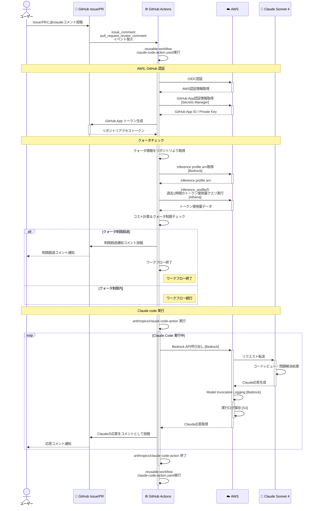
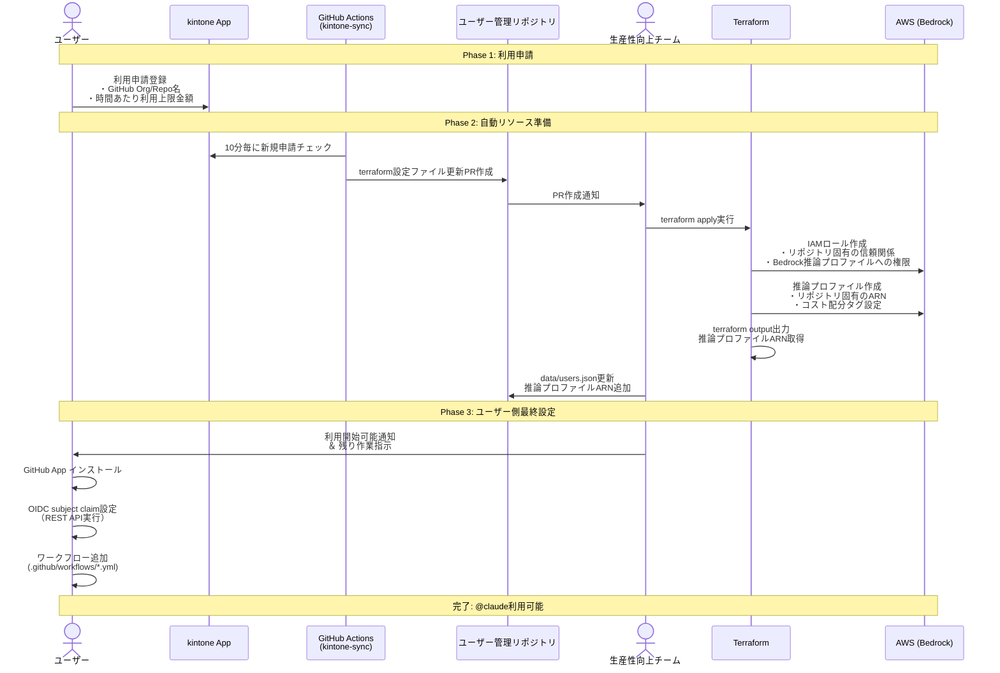

:::message
この記事は、[CYBOZU SUMMER BLOG FES '25](https://cybozu.github.io/summer-blog-fes-2025/) の記事です。
:::

こんにちは。サイボウズ株式会社、[生産性向上チーム](https://www.docswell.com/s/cybozu-tech/5R2X3N-engineering-productivity-team-recruitment-information)の平木場（[@korosuke613](https://korosuke613.dev)）です。今回は Claude Code Action を全社で利用するために構築した基盤について紹介します。構築した基盤はベータ版としてアーリーアダプタにフィードバックをもらいながら改善をしているフェーズです。

本家 Claude Code Action をそのまま使うのではなく、なぜ独自システムを構築したのか、そしてどのような特徴があるかなどを紹介します。

本記事の想定読者です。

<!-- textlint-disable @textlint-ja/ai-writing/no-ai-hype-expressions -->
- 大規模な組織で Claude Code Action を導入したいが、次のような考慮事項が存在している
  - セキュリティやログ管理の要件がある
  - 利用者ごとのクォータを設定したい
  - 利用開始ハードルを下げたい
- AWS を完全に理解している[^aws_understand]
<!-- textlint-enable @textlint-ja/ai-writing/no-ai-hype-expressions -->

[^aws_understand]: もちろんネタです。AWS の話が多いですが、AWS の詳しい解説はしないので、AWS の話について来られる人/適宜調べられる人を想定しているという意味です。

# 背景
生産性向上チームでは社内の開発生産性向上のために様々な基盤の整備や技術支援を行なっています。最近はさまざまな AI コーディングツールが登場しており、うまく使うことで開発生産性を向上させることができると考えています。

昨今様々なリモートコーディングエージェントツールが登場していますが、個人的には Anthropic 社の Claude Code Action に注目しています。GitHub Actions のワークフローに組み込めることから、一人のコントリビューターとしてだけでなく、プログラマブルにリモートコーディングエージェントを活用できるため、業務フローや CI/CD に対して AI の組み込みが可能となり、さらなる生産性向上を期待できるからです。そこで、Anthropic 社の Claude Code Action を広く手軽に社内で利用できる基盤を整備しようとなりました。

なお、スピード感を持って基盤構築をするために「**AI 開発生産性爆アゲ業務ソン**」と銘打って 2025/07/22–24 の 3 日間、次の 2 チームで活動しました。

- **リモートコーディングエージェント基盤開発**
  Claude Code Action を AWS 基盤込みでシュッと使える基盤を開発する
- **AI Gateway 基盤開発**
  開発者が LLM モデルを各種プロバイダーとの契約なしにシュッと使える基盤を開発する

今回は前者のリモートコーディングエージェント基盤開発についての話になります。後者については [AI Gateway を AI 開発生産性爆アゲ業務ソンで実装した話](https://zenn.dev/cybozu_ept/articles/summer-blog-fes-20250730-ai-gateway-litellm) をチェックしてください。

:::message
なお、平木場はいても立ってもいられなくなってしまって業務ソンが始まる前から空いた時間でこっそり基盤開発を進めていました。

本番の 3 日間では新卒の [@takoeight0821](https://zenn.dev/takoeight0821) と一緒に社内クローズドベータ提供開始までをやりきりました。利用申請から利用までのフローを半自動化してくれたりセキュリティ担保のためのあれこれを考えてくれたりとめちゃやってもらいました。
:::

# 概要

本記事では、組織で Claude Code Action を安全かつ効率的に利用するために構築した基盤について紹介します。

**なぜ独自基盤が必要だったのか？**

Claude Code Action をそのまま使うと、次の課題があります。
- 利用者ごとに Anthropic API 契約や GitHub App 作成が必要で利用開始のハードルが高い
- セキュリティポリシーの強制や実行ログの一元管理ができない
- 利用者ごとのクォータ制御ができずクラウド破産のリスクがある

**基盤で実現したこと**

1. **利用開始の簡単化**
   - kintone アプリでの利用申請により、AWS 契約と GitHub 認証を一元化
   - 申請から利用開始までを半自動化

2. **セキュリティと運用管理の自動化**
   - reusable workflow によるセキュリティポリシーの強制
   - Amazon Bedrock を活用した実行ログの一元保存・分析

3. **コスト管理**
   - リポジトリごとの推論プロファイル作成によるクォータ制御
   - GitHub Actions 上でのリアルタイムクォータチェック

# 前提知識: Claude Code と Claude Code Action

**Claude Code**

[Claude Code](https://docs.anthropic.com/en/docs/claude-code) は、Anthropic の Claude AI をコマンドライン環境で利用できる公式 CLI ツールです。ターミナルから直接 Claude と対話し、コードの生成・編集・レビューなどを行うことができます。

**Claude Code Action**

[Claude Code Action](https://docs.anthropic.com/en/docs/claude-code/github-actions) は、Claude Code を GitHub Actions 上で実行するためのワークフローです。Issue やプルリクエストのコメントをトリガーにして、リポジトリ上で自動的に Claude AI が動作し、コードの変更や提案を行います。

**動作の流れ：**
1. GitHub Issue / PR で `@claude` でコメント
2. GitHub Actions ワークフロー実行
3. Claude AI がリポジトリのコンテキストを理解
4. 要求された作業（コード修正、レビュー等）を実行
5. 結果をコメントやコミット・ブランチ作成として返す

また、最近入った `mode: agent` を使うと、`workflow_dispatch` や `schedule` トリガーでも動作可能になり、プログラマブルに Claude Code を利用できます。

似たツールに [GitHub Copilot Coding Agent](https://docs.github.com/en/copilot/concepts/coding-agent/coding-agent) があります。Coding Agent は GitHub Copilot を契約している場合に使えるリモートコーディングエージェントです。Claude Code Action と似たようなツールですが、課金体系に大きな違いがあると言えます。

:::message
GitHub Copilot Coding Agent は、GitHub Copilot の契約が必要で、定額課金です。使わなくても料金が発生します。
一方、Claude Code Action は、Claude Pro/Max による定額課金、あるいは Anthropic API、Amazon Bedrock、Google Vertex AI の API による従量課金を選択できます。使わなくても料金が発生しないため、組織としては少ない予算で多くのリポジトリで手軽に始められるのが嬉しいですね。

もし定額課金しか選択肢がなかった場合、両方使う理由をちゃんと説明するか、GitHub Copilot とどちらかを選ぶことになってたかなと思います。
:::

# 組織的に Claude Code Action を使う上で考えたいこと

組織的に Claude Code Action を使って各々の生産性を向上させるためには、いくつかの考慮点があります。

自分は社内でのびのびと Claude Code Action を使ってもらえるように必要な要素を次だと考えました。

- 利用開始ハードルが低い
- セキュリティが自動で担保されている
- 実行ログが保持されている
- クラウド破産を防止する仕組みがある

## 利用開始ハードルを低くするために

利用者が利用開始をする上で一番のネックになるのは Anthropic API の契約と GitHub 認証方法の用意だと考えました。

### Anthropic API の契約を一元化する

:::message
2025 年 9 月 2 日追記。

本記事を出した翌日、2025 年 8 月 21 日に Claude Team/Enterprise プランでも Claude Code Action が利用可能になりました。

> Claude Code is now available on Team and Enterprise plans.
>
> Flexible pricing lets you mix standard and premium Claude Code seats across your organization and scale with usage.
https://x.com/claudeai/status/1958230849171952118

本節も若干追記しましたが、実際に使ってないためわかってない事も多いです。調べた感じでは、組織で Claude Code Action を使う目的ならばまだ Claude Team/Enterprise プランではないのかなという感想です。
:::

Claude Code Action を利用するには Claude API にアクセスする必要があります。主な方法は次の 4 つになります。

- Claude Pro/Max を契約
- Claude Team/Enterprise を契約
- Anthropic API を契約
- Amazon Bedrock を契約
- Google Vertex AI を契約

Claude Pro/Max は個人向けのサブスクリプションで、OAuth トークンを発行することで定額で利用できますが、個人にひもづくことから組織での利用には適していません。Claude Team/Enterprise は組織向けのサブスクリプションであり、ユーザーごとの追加課金で Claude Code が利用でき、OAuth トークン発行で Pro/Max と同様に Claude Code Action が利用できると思われますが、これも調べている限りは個人にひもづくことになりそうです。とは言え組織向けの機能（[支出上限設定、利用可能 MCP サーバの制限など](https://www.anthropic.com/news/claude-code-on-team-and-enterprise)）が使えるので、個人に紐づいても良いという場合は選択肢になり得るかもしれません。Bot ユーザーを作成するという選択肢もあるかもしれないですが、規約上可能かどうかは未確認です。詳しい方いたら教えてください（2025 年 9 月 2 日追記）。

<!-- textlint-disable ja-technical-writing/no-unmatched-pair -->
Anthropic API は、最新の機能にアクセスできるものの、API キーの管理が必要で、API キーの作成の自動化ができない、利用料制限ができない、利用ログを残せない、登場したばかりでノウハウが少ないなど、やはり組織での利用には適してないと考えます。
（2025 年 9 月 2 日追記：Claude Team/Enterprise においてはユーザ単位の支出上限設定ができるようになったようなので、もしかしたら API でも同様のことができるようになったかもしれませんが、詳細はわかってません。詳しい方いたら(ry）
<!-- textlint-enable ja-technical-writing/no-unmatched-pair -->

[Amazon Bedrock](https://aws.amazon.com/jp/bedrock/) は AWS のサービスで、実行ログの保存、OIDC による認証、他の AWS サービスとの連携が可能です。AWS 上でワークロードを構築することで、クォータやセキュリティ、監査ログの要件を満たすことができます。

Google Vertex AI は Google Cloud のサービスですが、あまり使っておらず、詳しく調べていません。AWS と同等の機能は提供されているかなと思いますが、実際の運用経験がないため、ここでは触れません。

組織的に利用する場合は Amazon Bedrock、あるいは Google Vertex AI を利用するのが良いかと考えます。


### GitHub 認証方法を一元的に用意する
Claude Code Action が Issue にコメントしたりコードをプル、プッシュしたりするためには GitHub への認証が必要です。

GitHub への認証方法には主に次の 4 つがあります。

- Claude GitHub App を利用する
- `GITHUB_TOKEN` を利用する
- GitHub App を作成・利用する
- Personal Access Token を作成・利用する

この中で、Claude 公式の GitHub App を利用するのが最も簡単ですが、これは Anthropic 社に GitHub リポジトリの権限を与えることになります。Anthropic 社は社内の GitHub リポジトリへの読み書きができてしまうことになるため、セキュリティ上の懸念があります[^somosomo]。

また、Personal Access Token はユーザーにひもづくトークンであるため、複数人で開発するリポジトリの GitHub Actions では使いたくありません。長命であることも使いたくない理由の 1 つです。

そうなると残ったのが `GITHUB_TOKEN` と独自の GitHub App 作成になります。

`GITHUB_TOKEN` はワークフロー上で権限を設定でき、事前の用意が不要で、短命と多くのメリットがありますが、仕様上 `GITHUB_TOKEN` の権限でプッシュされたコミットは他の GitHub Actions ワークフローをキックしません[^not_trigger]。そのため、Claude Code Action にコードを書かせてもそれに対する CI/CD が走らず、不便です。

[^not_trigger]: *When you use the repository's `GITHUB_TOKEN` to perform tasks, events triggered by the `GITHUB_TOKEN`, with the exception of workflow_dispatch and repository_dispatch, will not create a new workflow run.* ref: https://docs.github.com/en/actions/how-tos/write-workflows/choose-when-workflows-run/trigger-a-workflow#triggering-a-workflow-from-a-workflow

独自の GitHub App は権限を細かく設定できますが、もちろん　GitHub App の作成が必要で、GitHub App の秘密鍵を安全に保管する必要があり、これまた用意が面倒です。

ここまでをまとめると、次のようになります。

|方法|メリット|デメリット|
|---|---|---|
|Claude GitHub App|・設定が最も簡単|・Anthropic社がリポジトリへの認証情報を握る|
|`GITHUB_TOKEN`|・事前設定不要<br />・短命トークン<br />・ワークフローワイルで権限設定可能|・他のワークフローをトリガーしない|
|独自GitHub App|・権限を細かく設定可能<br />・組織管理しやすい|・事前準備が必要<br />・秘密鍵の安全な保管が必要<br />|
|Personal Access Token|・権限を細かく設定可能<br />・利用方法がシンプル|・ユーザーにひもづくため複数人開発に不適切<br />・長命トークン|

組織的に使う場合、Claude GitHub App、Personal Access Token は避けたいです。`GITHUB_TOKEN` は準備が楽ですが、デメリットが大きいです。となると最終的には独自の GitHub App を作成するのが総合的に良さそうです。
しかし、利用者がそれぞれ独自の GitHub App を作成するのは手間がかかる上に Organization 管理者による作業が必要で面倒です。

利用者の手間を減らすために、共通の GitHub App を用意することが考えられます。Claude Code Action 呼び出し前にうまく共通の GitHub App で認証する仕組みがほしいですね。

[^somosomo]: そもそも Claude Code を実行するときにリポジトリへの権限を渡しているのだから同じでは？と思うかもしれません。結局はどこまで線引きするかという話になりますね。


## セキュリティを自動で担保するために
社内ルールやセキュリティポリシーが存在する場合、Claude Code Action に対する制限をかけたいかもしれません。（例：許可したホストのみ通信可能にする、`disallowed_tools` で必ず特定のツールを禁止する）

組織の利用者に対して anthropics/claude-code-action を直接実行させずに、[custom action](https://docs.github.com/en/actions/concepts/workflows-and-actions/custom-actions) や [reusable workflow](https://docs.github.com/en/actions/using-workflows/reusing-workflows) でオリジナルのアクションをラップしたものを提供することで、セキュリティポリシーを強制できます。

## 実行ログを保持するために
法的要件や内部統制への対応が必要な場合、すべての実行ログを一元的に保存したくなります。GitHub Actions のログは決められた保持期限がありますし、横断的に検索することは困難です。

先で紹介した Bedrock や Vertex AI を利用して、実行ログを S3 や BigQuery に保存する方法や、GitHub Actions のログを必ずどこかへ送信する方法などで実現できます。もし GitHub Actions 上でログを保存する場合はこれまた先で紹介した custom action や reusable workflow によるラップが有効です。

## クラウド破産を防止するために
利用者が使いすぎてクラウド破産を免れるために、何らかのクォータを設定し、クォータを超える場合は使えないようにする仕組みが必要です。

全体のクォータ、あるいは利用者ごとのクォータを設定することが考えられます。全体のクォータについてはプラットフォーム側で予算上限を超えそうな場合に通知を飛ばすなど標準機能で解決できる場合が多いと思います。しかし、利用者ごとのクォータを設定する場合は工夫が必要になります。

利用者ごとのクォータを実現するには利用者ごとに使用量が計測できなければいけません。Amazon Bedrock や Google Vertex AI では推論プロファイル/エンドポイントを利用者ごとに用意することで、利用者ごとに使用量を計測できると考えます。
また、クォータを超えた場合に実行させないようにできる必要があります。これは即座に実行を止めたいか、あるいは anthropics/claude-code-action 実行前にクォータチェックを行い、クォータを超えている場合は実行しないようにするかの 2 パターンが考えられます。

前者は実装が面倒そうだと思ったので詳しくは考えていません。後者に関しては、custom action や reusable workflow でのラップで実現可能です。

# 社内 Claude Code Action 基盤の開発

上記の考え事を踏まえて、社内向けに anthropics/claude-code-action をラップした reusable workflow、および、利用のための基盤を開発しました。

**開発方針**

- 利用者が簡単に利用開始できるようにする
  - 単一の専用 AWS アカウントで契約を一元化
  - 専用の GitHub App をあらかじめ用意
  - kintone アプリで利用リポジトリを申請・管理
- 自由度の高い利用ができるようにする
  - GitHub 認証方法の選択肢を用意
    - 専用の GitHub App or `GITHUB_TOKEN` or リポジトリ管理者用意の GitHub App
  - オリジナルの Claude Code Action と同じ inputs を用意
- ログ保存・分析ができるようにする
  - Amazon Bedrock の推論プロファイルをリポジトリごとに用意
  - Amazon Bedrock のログ機能を用いて実行ログを S3 に保存
- リポジトリごとにクォータを設定できるようにする
  - Claude Code Action 実行前にクォータ超過をチェックして、超過している場合は実行しない
- reusable workflow で Claude Code Action をラップ


**アーキテクチャ**

基盤のおおまかなアーキテクチャは次のようになっています。


**利用フロー**

ユーザーが `@claude` してから完了までのおおまかなフローです。



## 認証の一元化
Claude Code Action を利用するには Anthropic API（via Amazon Bedrock）を使うための AWS への認証と対象リポジトリを操作するための GitHub への認証が必要です。

### AWS 認証

今回、生産性向上チームで新たに作成した単一の AWS アカウントを使うことにしました。これにより利用者は新たに AWS アカウントを作ったり契約したりする必要がありません。
GitHub Actions から AWS へ認証するにはいろいろな方法がありますが、選択肢の中で最もセキュアだと考えられる OIDC、および、[aws-actions/configure-aws-credentials](https://github.com/aws-actions/configure-aws-credentials) を使った認証方法を採用しました[^OIDC]。

[^OIDC]: OpenID Connect（OIDC）を使った認証の詳細は[GitHub Actions OIDC公式ガイド](https://docs.github.com/en/actions/deployment/security-hardening-your-deployments/about-security-hardening-with-openid-connect)および[AWS OIDC Identity Provider設定](https://docs.aws.amazon.com/IAM/latest/UserGuide/id_roles_providers_create_oidc.html)を参照してください。

次のような信頼関係を持つ IAM Role をリポジトリごとに作成し、リポジトリ名に合わせて aws-actions/configure-aws-credentials に渡す IAM Role ARN を自動的に切り替えるようにしています。

```json
{
    "Version": "2012-10-17",
    "Statement": [
        {
            "Effect": "Allow",
            "Principal": {
                "Federated": "arn:aws:iam::<AWS アカウント ID>:oidc-provider/token.actions.githubusercontent.com"
            },
            "Action": "sts:AssumeRoleWithWebIdentity",
            "Condition": {
                "StringEquals": {
                    "token.actions.githubusercontent.com:aud": "sts.amazonaws.com"
                },
                "StringLike": {
                    "token.actions.githubusercontent.com:sub": [
                        "repo:<リポジトリオーナー>/<リポジトリ名>:job_workflow_ref:<reusable workflowのオーナー>/claude-code-action-workflow/.github/workflows/claude-code-action.yaml@*"
                    ]
                }
            }
        }
    ]
}
```

OIDC の条件を定める subject claim に当たる `token.actions.githubusercontent.com:sub` ではリポジトリ名を `repo` で、reusable workflow の ref を `job_workflow_ref` で指定しています。実は `job_workflow_ref` には呼び出し元ワークフローの ref ではなく reusable workflow の ref が入ります。`repo` のみの条件の場合、ユーザーの任意のワークフローで AWS へ認証できてしまうため、自由な API 実行を許可してしまいます[^akuyou]。今回クォータチェックは GitHub Actions 側で行っているため、クォータチェックを回避できてしまうことから、reusable workflow の ref も条件に入れています[^custom_action]。

[^akuyou]: 悪用する人もいないとは思いますが、見えている穴を閉じない理由もないので閉じています。
[^custom_action]: 今回 custom action ではなく reusable workflow を使っている大きな理由は OIDC で制御したかったためです。

:::message 
ここで落とし穴があります。なんと **GitHub Actions が OIDC トークンに含める subject claim はデフォルトでは `repo` のみ**となっています（なんで？）。したがって、`job_workflow_ref` はキーそのものが設定されず、そのままでは認証できません[^shunsuke-suzuki]。
subject claim のテンプレートはリポジトリごとに [REST API で設定](https://docs.github.com/en/rest/actions/oidc#set-the-customization-template-for-an-oidc-subject-claim-for-a-repository)できます[^organization_sub]。この API はリポジトリオーナーであれば実行可能です。

- [`PUT /repos/{owner}/{repo}/actions/oidc/customization/sub`](https://docs.github.com/en/rest/actions/oidc#set-the-customization-template-for-an-oidc-subject-claim-for-a-repository)

したがって、我々の場合利用開始ドキュメントでは `use_default=true` の場合に次のコマンドを実行してもらうようにしています。

```bash
gh api \
--method PUT  -H "Accept: application/vnd.github+json" \
-H "X-GitHub-Api-Version: 2022-11-28" \
/repos/<OWNER>/<REPO>/actions/oidc/customization/sub \
-F "use_default=false" -f 'include_claim_keys[]=repo' -f 'include_claim_keys[]=job_workflow_ref'
```

最初この仕様を知らなくてだいぶ四苦八苦しました。ちなみに、GitHub Actions で使える subject claim は [github/actions-oidc-debugger](https://github.com/github/actions-oidc-debugger) というアクションを使って確認できます。しかし、自分はわざわざアクションを増やしたくなかったので、`curl -s -H "Authorization: bearer ${ACTIONS_ID_TOKEN_REQUEST_TOKEN}" "${ACTIONS_ID_TOKEN_REQUEST_URL}" | jq '.value | split(".") | .[1] | @base64d | fromjson'` をジョブで実行して同じ情報を確認するようにしています（[miyajan さんの記事](https://zenn.dev/miyajan/articles/github-actions-support-openid-connect#github-actions-%E3%81%A7-oidc-%E3%83%88%E3%83%BC%E3%82%AF%E3%83%B3%E3%81%AE%E3%83%98%E3%83%83%E3%83%80%E3%83%BC%E3%82%84%E3%83%9A%E3%82%A4%E3%83%AD%E3%83%BC%E3%83%89%E3%81%AF%E3%81%A9%E3%81%86%E3%82%84%E3%81%A3%E3%81%9F%E3%82%89%E7%A2%BA%E8%AA%8D%E3%81%A7%E3%81%8D%E3%82%8B%EF%BC%9F)に書いてました）。

[^organization_sub]: organization 単位で設定することも可能ですが、影響範囲が大きく考えることが多くなるためリポジトリごとの設定を行うようにしています。
[^shunsuke-suzuki]: shunsuke-suzuki 氏のブログにも書いてありました。https://zenn.dev/shunsuke_suzuki/articles/secure-github-actions-by-pull-request-target#oidc-%E3%81%AE%E8%A8%AD%E5%AE%9A

:::


### GitHub 認証

次は GitHub の認証です。先に述べた通り、GitHub App と `GITHUB_TOKEN` の 2 つの認証方法のみサポートするようにしました。さらに、GitHub App は我々が用意したものと、利用者が用意したものの 2 つを選択できるようにしています。

困ったのがどのように秘密鍵を保管するかでした。最初は GitHub Actions の Organization Secrets や Repository Secrets に保存することを考えましたが、organization owner や repository admin の作業負担が増えることと、秘密鍵へアクセスできる人物が増えて退職者管理が面倒になることから、AWS Secrets Manager に保存することにしました。

repository owner から organization を特定し、対象の secrets manager から秘密鍵を取得、[actions/create-github-app-token](https://github.com/actions/create-github-app-token) を使ってアクセストークンを生成するようにしています。

また、GitHub App をインストールしている他のリポジトリへのアクセスを防ぐため、actions/create-github-app-token では `with.owner`、`with.repositories` でリポジトリを指定するようにしています。

```yaml
- id: create-github-app-token
  uses: actions/create-github-app-token@v2
  with:
    app-id: ${{ steps.setup-github-credentials.outputs.app_id }}
    private-key: ${{ steps.setup-github-credentials.outputs.private_key }}
    owner: ${{ github.repository_owner }}
    repositories: ${{ github.event.repository.name }}
```

また、他のリポジトリへのアクセス許可を与えたいや、他の権限を与えたいなど、柔軟に GitHub の権限を渡したい利用者向けに、利用者作成の GitHub App を利用できるオプションも用意しています。

## 実行ログの一元保存＆分析のための準備

実行ログは Bedrock の Model Invocation Logging 機能を使って S3 に保存するようにしています。というかそれ以外の AWS 側でのログ保存方法は無さそうです。

Claude Code Action 実行のたびに S3 には次のような JSON が保存されます。

```json
{
  "timestamp": "2025-08-07T02:48:23Z",
  "accountId": "<アカウントID>",
  "identity": {
    "arn": "<Assume role arn>"
  },
  "region": "<リージョン>",
  "requestId": "c448be01-5f60-4d31-8049-xxxxxxxxxxxx",
  "operation": "InvokeModelWithResponseStream",
  "modelId": "arn:aws:bedrock:<リージョン>:<アカウントID>:application-inference-profile/<ランダム文字列>",
  "input": {
    "inputContentType": "application/json",
    "inputBodyS3Path": "<outputBodyJson の保存先 S3 パス>",
    "inputTokenCount": 3,
    "cacheReadInputTokenCount": 0,
    "cacheWriteInputTokenCount": 28857
  },
  "output": {
    "outputContentType": "application/json",
    "outputBodyJson": <Claude Code が出力する JSON>,
    "outputTokenCount": 142
  },
  "inferenceRegion": "us-east-2",
  "schemaType": "ModelInvocationLog",
  "schemaVersion": "1.0"
}
```

大事なのは利用者を特定する `modelId`[^identity]（inference profile arn）と利用料を計算するのに必要な `input.inputTokenCount`、`input.cacheReadInputTokenCount`、`input.cacheWriteInputTokenCount`、`output.outputTokenCount` です。これらの情報を元に、各リポジトリでどれくらいのトークンを使ったか、どれくらいのコストがかかったかを計算できます。

また、`output.outputBodyJson` には Claude Code が出力する JSON が保存されます。Claude Code Action 実行中に出てくる JSON 形式のログそのものが入っています。実行ログを分析したい場合はここを見ることになります。

S3 に保存されるログは AWS Glue、Amazon Athena で分析できるので、分析できる状態にします。
まずはログの JSON を元に Glue Table を作成します。

```sql
CREATE EXTERNAL TABLE `bedrock_logs_original`(
  `schematype` string, 
  `timestamp` string, 
  `region` string, 
  `identity` struct<arn:string>, 
  `operation` string, 
  `modelid` string, 
  `requestid` string, 
  `schemaversion` string, 
  `input` struct<inputbodys3path:string,inputtokencount:string,cachewriteinputtokencount:string,inputcontenttype:string,cachereadinputtokencount:string>, 
  `output` struct<outputcontenttype:string,outputbodyjson:string,outputtokencount:string>
)
PARTITIONED BY ( 
  `datehour` string
)
ROW FORMAT SERDE 
  'org.openx.data.jsonserde.JsonSerDe' 
WITH SERDEPROPERTIES ( 
  'case.insensitive'='true', 
  'ignore.malformed.json'='true'
) 
STORED AS INPUTFORMAT 
  'org.apache.hadoop.mapred.TextInputFormat' 
OUTPUTFORMAT 
  'org.apache.hadoop.hive.ql.io.HiveIgnoreKeyTextOutputFormat'
LOCATION
  's3://<S3バケット名>/AWSLogs/<アカウント名>/BedrockModelInvocationLogs/us-west-2/'
TBLPROPERTIES (
  'numFiles'='0', 
  'numRows'='0', 
  'projection.datehour.format'='yyyy/MM/dd/HH', 
  'projection.datehour.interval'='1', 
  'projection.datehour.interval.unit'='HOURS', 
  'projection.datehour.range'='2025/07/29/00,NOW', 
  'projection.datehour.type'='date', 
  'projection.enabled'='true', 
  'storage.location.template'='s3://<S3バケット名>/AWSLogs/<アカウント名>/BedrockModelInvocationLogs/us-west-2/${datehour}/'
)
```

ログのオブジェクトは `/AWSLogs/<アカウントID>/BedrockModelInvocationLogs/<リージョン>/<yyyy>/<MM>/<dd>/<HH>/hoge.json.gz` に保存されます（`yyyy` は西暦 4 桁、`MM` は月 2 桁、`dd` は日 2 桁、`HH` は 0-23 時までの時間 2 桁を表します）。したがって、`yyyy/MM/dd/HH` の形式でパーティションを作成することで日時に関するクエリを効率的に実行できます。

また、ディレクトリによっては `/AWSLogs/<アカウントID>/BedrockModelInvocationLogs/<リージョン>/<yyyy>/<MM>/<dd>/<HH>/data` というように `data` ディレクトリが存在します。あったりなかったりするのでどういう条件でできるのかよくわかっていませんが、ここには実行ログの JSON が入っています。スキーマが全く異なり、クエリ実行時にエラーを吐く原因となるため、`data` ディレクトリを除外するビューを作成しておきます。

```sql
CREATE VIEW bedrock_logs AS
SELECT *
FROM bedrock_logs_original
WHERE "$path" NOT LIKE '%/data/%'
```

このビューに対してクエリを実行することで様々な分析が可能となります。

[^identity]: この記事を書いて思ったのですが、実は `identity` にある Assume role arn を使えば、inference profile arn を特定しなくても利用者を特定できるのでは？と思いました。それができると処理が楽になるはず...

## クォータチェック

先で作ったビューに対して次のクエリを実行することで、過去 n 時間のトークン使用量を取得できます。今回は過去 1 時間を例として説明します。

```sql:トークン使用量取得クエリ
SELECT 	
  SUM(CAST(input.inputtokencount AS BIGINT)) AS input_tokens,
  SUM(CAST(output.outputtokencount AS BIGINT)) AS output_tokens,
  SUM(CAST(input.cachereadinputtokencount AS BIGINT)) AS cache_read_tokens,
  SUM(CAST(input.cachewriteinputtokencount AS BIGINT)) AS cache_write_tokens
FROM bedrock_logs
-- パーティションを効かせるために先に datehour でフィルタリング
WHERE datehour >= format_datetime(current_timestamp - INTERVAL '1' HOUR, 'yyyy/MM/dd/HH')
  AND from_iso8601_timestamp(timestamp) >= current_timestamp - INTERVAL '1' HOUR
  -- modelid は inference profile arn を指定
  AND modelid = 'arn:aws:bedrock:<リージョン>:<アカウントID>:application-inference-profile/<ランダム文字列>'
```

**結果例**

|#|input_tokens|output_tokens|cache_read_tokens|cache_write_tokens|
|---|---|---|---|---|
|1|205|14778|1518457|97613|

この例では、指定した inference profile（≒リポジトリ）において、過去 1 時間で入力トークンが 205、出力トークンが 14778、キャッシュ読み取りトークンが 1518457、キャッシュ書き込みトークンが 97613 使用されたことが示されています。

この値を元にコスト計算をし、クォータ超過確認をします。

コスト表とクォータ設定は別リポジトリで管理しています[^another_repo]。ちなみに、クォータ設定は kintone アプリで管理し、スケジュール実行で同期するような仕組みにしています。

[^another_repo]: 正直リポジトリ管理は権限まわりで面倒なので、DynamoDB やら SSM Parameter Store やらで管理するようにしたいですね...

```json:price.json
{
  "$schema": "./price.schema.json",
  "models": {
    "us.anthropic.claude-sonnet-4-20250514-v1:0": {
      // 1000 トークンあたりの USD（価格は[Amazon Bedrock料金表](https://aws.amazon.com/jp/bedrock/pricing/)に基づく）
      "input_token_usd_per_1000": 0.003,
      "output_token_usd_per_1000": 0.015,
      "cache_read_usd_per_1000": 0.0003,
      "cache_write_usd_per_1000": 0.00375
    },
    "us.anthropic.claude-3-5-haiku-20241022-v1:0": {
      "input_token_usd_per_1000": 0.0008,
      "output_token_usd_per_1000": 0.004,
      "cache_read_usd_per_1000": 0.001,
      "cache_write_usd_per_1000": 0.00008
    }
  }
}
```

:::message
使わないはずの Claude 3.5 haiku (us.anthropic.claude-3-5-haiku-20241022-v1:0) もコスト表にある理由は、Claude Code Action が処理を行う前に Claude 3.5 haiku を呼び出してプロンプトを調整しているためです。Claude Code Action を使ってる人はログを細かく見てみてください。inference profile に紐づかないですが、コストを出せるようにコスト表に含めています。
:::

```json:users.json
{
  "$schema": "./users.schema.json",
  "inference_profile": {
    // inference profile arn ごとに設定
    "arn:aws:bedrock:<リージョン>:<アカウントID>:application-inference-profile/<ランダム文字列>": {
      "base_model_inference_profile_id": "us.anthropic.claude-sonnet-4-20250514-v1:0",
      "github": {
        "org": "<organization 名>",
        "repo": "<リポジトリ名>"
      },
      "quota": {
        "enabled": true,
        // このリポジトリでは 1 時間あたり 3 ドルまで利用可能としている
        "limit_usd_hour": 3
      }
    },
    ...
  }
}
```

この price.json、users.json と過去 1 時間のトークン使用量を元にコストを計算します。
先に示した例だと、次のような計算になります。

- 入力トークン: 205 * 0.003 / 1,000 = 0.000615 USD
- 出力トークン: 14,778 * 0.015 / 1,000 = 0.22167 USD
- キャッシュ読み取りトークン: 1,518,457 * 0.0003 / 1,000 = 0.4555371 USD
- キャッシュ書き込みトークン: 97,613 * 0.00375 / 1,000 = 0.36604875 USD
- 合計: 1.04 USD（少数第三位で四捨五入）

どうやらこのリポジトリでは過去 1 時間で 1.04 USD 使ったようですね。余裕でクォータ内です。

こういった計算を Claude Code Action 実行前に行うことで、クォータ超過を防止します。

クォータチェックを Athena のクエリ実行で実現しているのは、Bedrock のネイティブ機能では利用者ごとの時間単位のクォータ設定ができないことと、CostExplorer は料金反映に時間がかかることためです。また、Claude の API 呼び出し前にクォータチェックを行うために GitHub Actions ワークフローに組み込んでいます[^lambda]。

[^lambda]: しかし、ワークフロー上で計算するまではしなくていいかなと今は考えています。例えばクォータチェックを行う Lambda を用意して GitHub Actions から Invoke するという手もあります。これで実行の高速化と Actions 上の権限（Athena クエリ実行）の縮小が可能です。しかし、Lambda を用意するのを躊躇ってしまい今の実装となっています。

# 社内 Claude Code Action 基盤の利用フロー

社内 Claude Code Action 基盤を利用するための準備について説明します。ユーザーが利用申請を行い、基盤側で AWS リソースを作成し、最後にユーザー側で簡単な設定作業を行います。

従来であれば利用者が次の作業を個別に行う必要がありました。
- AWS アカウントの作成・契約
- Anthropic API の契約
- GitHub App の作成・設定
- 各種認証情報の管理

基盤利用により、利用者が入力するのは次の 3 つの情報のみになります。
- GitHub Organization 名
- GitHub Repository 名
- 時間あたりの利用上限金額（USD）

本基盤を利用することで、利用者の作業は次のように削減されます。

|項目|従来|基盤利用後|
|---|---|---|
|AWS契約|各自で契約・支払い設定|不要（一元化済み）|
|API契約|Anthropic API個別契約|不要（Bedrock経由）|
|GitHub App|個別作成・権限設定|不要（共通App利用）|
|認証情報管理|各自でSecrets管理|2つのAPIコマンド実行のみ|
|利用開始までの時間目安|数日〜1週間|申請から半日〜1日程度|

だいたいの流れは次のようになります。



なお、利用申請、および、ユーザー管理には [kintone](https://kintone.cybozu.co.jp/) を利用しています。利用申請がされると、半自動的にインフラリソース構築のためのプルリクエスト（Terraform）が作られるため、管理側である我々はオペレーションミスの低減、および対応速度の向上が図れています。

まだまだこの利用開始フローは改善できる点が多いため、今後もっと良くしていきたいです。

# 社内 Claude Code Action 基盤の工夫

## セキュリティルールの整備

ユーザー向けマニュアルにセキュリティルールを用意しています。利用する上で見るべき社内外のドキュメントや利用禁止項目をまとめています。

利用禁止項目の一例です。一般的なもののみ挙げます。

- 🚫 GitHub Actions Secrets 読み取り権限付与（`secrets: read/write`）
- 🚫 GitHub Actions Workflow 変更権限付与（`workflows: write`）
- 🚫 デフォルトブランチ・デプロイを伴うブランチで自由に push、マージできる状態になっている（対策：ruleset で保護するようにする - force push 禁止、プルリクによるマージのみ許容、削除保護など）

また、reusable workflow という性質上、`allowed_tools`、`disallowed_tools` に渡す値を制限したり、追加したりすることも可能です。例：`WebFetch` を全く使えないようにするために `disallowed_tools` に含める。

## 週次・月次レポートの自動生成

利用者、および、我々がどれだけ社内 Claude Code Action が利用されてるかを簡単に把握できるように、週次・月次レポートを Issue として自動生成しています。
本当は Amazon QuickSight などの BI サービスでリッチに可視化したい気持ちもありますが、料金的にも手間的にも安上がりにするために現在は Issue でのレポートにしています。

実際に生成されるレポートは次のような感じです。


*過去 1 週間分のリポジトリ別利用料例*

GitHub Actions 上で次のようなクエリを実行して、各リポジトリの利用料を集計、整形し、Issue 本文を更新するという感じです。

```sql
SELECT
    modelid,
    SUM(CAST(input.inputtokencount AS BIGINT)) as total_input_tokens,
    SUM(CAST(output.outputtokencount AS BIGINT)) as total_output_tokens,
    SUM(CAST(input.cachereadinputtokencount AS BIGINT)) as total_cache_read_tokens,
    SUM(CAST(input.cachewriteinputtokencount AS BIGINT)) as total_cache_write_tokens,
    COUNT(*) as request_count
FROM bedrock_logs
WHERE datehour >= format_datetime(current_timestamp - INTERVAL '7' DAY, 'yyyy/MM/dd/HH')
  AND from_iso8601_timestamp(timestamp) >= current_timestamp - INTERVAL '7' DAY
GROUP BY modelid
```

## anthropics/claude-code-base-action にも対応

当初、 anthropics/claude-code-action は issue comment、pull_request comment にのみ対応していたため、`workflow_dispatch` や `scheduled` で実行するには別に存在する anthropics/claude-code-base-action を利用する必要がありました。
プログラマブルに活用できるために `workflow_dispatch` や `scheduled` での実行は不可欠だったため、claude-code-base-action 用の reusable workflow も用意していました。

しかし、最近、anthropics/claude-code-action がエージェントモード（`mode: agent`）を追加し、`workflow_dispatch` や `scheduled` に対応したため、必ずしも `anthropics/claude-code-base-action` を利用する必要がなくなりました。
base action の reusable workflow は一応残していますが、今後無くしていく予定です。

## 間違いのないコスト分析ができるように inference profile に コスト配分タグを設定
Amazon Bedrock でモデル呼び出しにかかったコストを Cost Explorer で分析するためには、[inference profile にコスト配分タグを設定](https://aws.amazon.com/jp/about-aws/whats-new/2024/11/amazon-bedrock-cost-allocation-tags-inference-profiles/)する必要があります。

本基盤ではクォータチェックの節で書いたように、Athena でログ分析をすることでコスト分析は可能です。しかし、呼び出し単価の変更やバグなどで計算が間違ってしまう可能性を否定できません。本当にかかった額を正確に把握するためには Cost Explorer でも分析できるに越したことはないです。

inference profile は利用リポジトリごとに作成しているので、オーナー、リポジトリ名をそれぞれタグ付けし、コスト配分タグに指定しています。これにより、Cost Explorer でもリポジトリごとのいくら使ったかすぐに把握できます。

# 社内 Claude Code Action 基盤の課題

まだまだベータ版で社内フィードバックをもらっている段階なのもあり、課題が盛りだくさんです。

- anthropics/claude-code-action の更新についていくのが大変
  - 更新頻度が高く、仕様変更も多い（破壊的変更は少なめだが）
  - Renovate で PR は作成させているが、把握が困難なので Claude Code にレビューと新機能対応もさせたりしている
- セキュリティと利便性のトレードオフ
  - セキュリティを重視すると、利用者の利便性が下がることがあるため、どこまでセキュリティを重視するかの判断が難しい
- public リポジトリ対応する？
  - public リポジトリでの利用は考えることが多く、現状別途 Anthropic API を契約してもらい、本家を使う方法が無難
    - 真面目に考えたらプロンプトインジェクションリスクを低くするのがむずそうで、会社の public リポジトリで使うのは厳しいのでは？となってる
- GHES 対応する？
  - GitHub Enterprise Server 向けには作ってないので現状 GHES では利用できない
    - 特にイントラネット上に GHES があると OIDC が無理ゲーに近い。[Google Cloud は回避策がある](https://zenn.dev/cybozu_ept/articles/c241f28b4f32ec)が、調べた限り AWS ではその回避策が使えない
  - 最近 Bedrock が API キーの吐き出しに対応したので方法は増えてきてるかも
- 社内 LLM API キー発行基盤で発行した API キーの活用
  - 同じく開発生産性爆アゲ AI 業務ソンで作られた社内 LLM API キーを活用することで Amazon Bedrock は必要なくなるが、社内 LLM API キー発行基盤はまだクォータ設定できなかったりベータ状態なので、要件が満たされたら今後活用できるようにしたい
- もっと利用者が Claude Code Action を活用しやすくするために活用事例を増やす・共有する
  - Claude Code Action は便利ではあるが、まだまだ使い方を模索中であり、活用方法がわからない人も多い。どんどん活用事例を増やしていきたい
  - 生産性向上チームでの活用事例
    - Issue のプランニングや調査、プルリクエストの実装
    - コードレビュー
    - Renovate の PR が作られたら自動でレビュー
    - 毎日の定時に昨日からの main ブランチの差分を読ませ、どういう変更があったかレポートさせる

# おわりに

開発生産性 AI 業務ソン + αで社内 Claude Code Action 基盤を作りましたが、これの開発にも多分に AI の力を借りました。特にクォータチェック用の Go のコードや、Athena のクエリ、その他もろもろだいぶ AI に最初のコードを書いてもらいました。やっぱり便利ですね。

現在この基盤は社内でベータという扱いにしており、アーリーアダプターを見つけてフィードバックをもらいながら改善を進めているフェーズです。まだまだリモートコーディングエージェント、および、本基盤が役に立つものなのかはわからないので、早めにどんどん社内フィードバックを得て、今後の判断につなげたいですね。実は無くても良いと判断したら普通に撤退します。

でも正直うまく活用してもらうことへの難しさを感じています。まずは使いやすい環境を用意しましたが、どのように使うと便利かはあまりまだ提示できてないため、もっと活用方法を広げていく必要があると思っています。なぜリモートで動くと嬉しいのかをしっかりと示す必要もあるかなと思っています。

あまり Claude Code Action 自体はちょくちょくブログ記事なんかも出てますが、あまり組織的に使う事例を見なかったので今回本記事を執筆しました。コメントとかあればどしどしご連絡ください。

:::message
[CYBOZU SUMMER BLOG FES '25](https://cybozu.github.io/summer-blog-fes-2025/) の他の記事もよろしく！
:::
