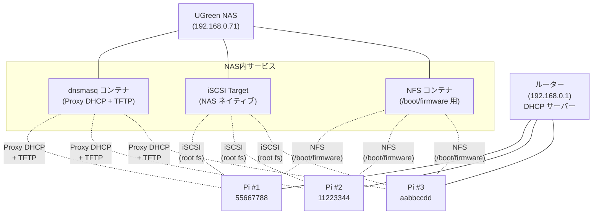
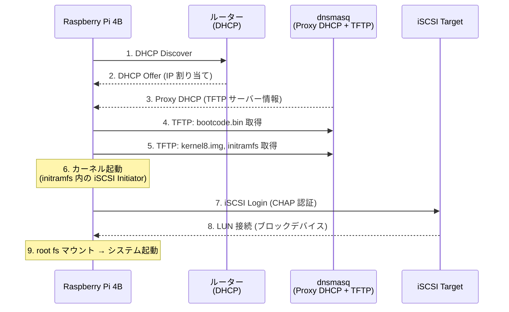

# はじめに

家庭で Raspberry Pi 4B を 3 台運用していると、SD カードの突然死に怯える日々を送ることになります。停電やカーネルパニックのたびに「今度はどの SD が壊れたか」と胃を痛めるのは健全とは言えません。

本記事では、SD カードを完全に排除し、**PXE（Preboot Execution Environment）と iSCSI を組み合わせたネットワークブート**で Raspberry Pi 4B を運用する構成の備忘録をまとめます。NAS の SSD 上に root ファイルシステムを配置し、ネットワーク経由でブートさせることで、SD カードの脆弱性から解放されます。

なお、本記事では PXE + iSCSI の構成に焦点を絞ります。この基盤の上に構築した k3s クラスタについては対象外とします。

構成ファイル一式はリポジトリで公開しています。

https://github.com/korosuke613/home-raspberry-pxe

# なぜネットワークブートか

## SD カードの課題

Raspberry Pi の標準的なブートメディアである SD カードには、次の課題があります。

- **書き込み寿命**: フラッシュメモリの書き込み回数には上限がある。ログ出力や一時ファイルの書き込みが積み重なると、数ヶ月〜数年で寿命を迎えることがある
- **停電時の破損リスク**: 書き込み中の突然の電源断で、ファイルシステムが破損して起動不能になることがある
- **個別管理の手間**: 複数台を運用する場合、SD カードごとに OS 設定を管理する必要がある

## ネットワークブートの利点

- **NAS での集中管理**: 全ノードのブートファイルと root ファイルシステムを NAS 上で一元管理できる
- **SSD の耐久性**: NAS に搭載した SSD は SD カードと比べて書き込み耐性が高く、寿命の心配が大幅に減る
- **バックアップの容易さ**: NAS 側でスナップショットやバックアップを取得すれば、全ノードのバックアップが完了する

## iSCSI vs NFS

ネットワークブートの root ファイルシステムには NFS と iSCSI の 2 つの選択肢があります。筆者は当初 NFS で運用していましたが、後に iSCSI へ移行しました。

| 項目 | iSCSI | NFS |
|---|---|---|
| アクセス方式 | ブロックデバイス | ファイル単位 |
| パフォーマンス | 高速（特にランダム I/O） | 中程度 |
| CPU 使用率 | 低い | やや高い |
| 複数ノードからの同時マウント | 不可（1 LUN = 1 ノード） | 可能 |
| 設定の複雑さ | やや複雑（initramfs 対応が必要） | シンプル |

iSCSI はブロックデバイスとして振る舞うため、OS から見ると物理ディスクと同じように扱えます。ext4 などのファイルシステムをそのまま載せられるため、NFS と比べてパフォーマンスが高く、互換性の問題も起きにくいのが利点です。

:::message
**HDD から SSD への移行**
当初は NAS の HDD 上に iSCSI LUN を配置していましたが、Pi が常時稼働しているため HDD の読み書き音が途切れることなく発生し、生活空間に置くには厳しい状態でした。そこで、NAS に搭載していた R/W キャッシュ用 SSD 2 枚のうち 1 枚を R キャッシュ専用に、もう 1 枚をストレージボリュームとして転用し、iSCSI LUN の配置先を SSD に変更しました。結果として、読み書き音の頻度が大幅に減り、パフォーマンスも向上しました。
:::

# システム構成

## ハードウェア

| 役割 | 機器 | 備考 |
|---|---|---|
| NAS / iSCSI Target + PXE サーバー | UGreen NAS (192.168.0.71) | Docker で dnsmasq を稼働、iSCSI Target は NAS ネイティブ |
| ノード 1 (pi-1) | Raspberry Pi 4B | シリアル: `55667788` |
| ノード 2 (pi-2) | Raspberry Pi 4B | シリアル: `11223344` |
| ノード 3 (pi-3) | Raspberry Pi 4B | シリアル: `aabbccdd` |
| ルーター | 既存のホームルーター (192.168.0.1) | DHCP サーバー兼用 |

## アーキテクチャ図



## ブートシーケンス

電源 ON からシステム起動までの流れを示します。



Raspberry Pi 4B は OTP（One-Time Programmable）ビットを設定することでネットワークブートが有効になります。電源 ON 後、まずルーターから IP アドレスを取得し、dnsmasq の Proxy DHCP から TFTP サーバーの情報を受け取ります。TFTP でカーネルと initramfs を取得した後、initramfs 内の iSCSI Initiator が iSCSI Target に接続し、LUN を root ファイルシステムとしてマウントします。

# サーバー側セットアップ

## Docker Compose

dnsmasq（Proxy DHCP + TFTP）と NFS サーバーを Docker Compose で管理しています。

```yaml:docker-compose.yaml
version: "3.8"

services:
    dnsmasq:
        image: strm/dnsmasq:latest
        container_name: dnsmasq-proxydhcp
        network_mode: host
        cap_add:
        - NET_ADMIN
        - NET_RAW
        environment:
        - TZ=Asia/Tokyo
        command:
        - "--conf-file=/config/dnsmasq.conf"
        - "--keep-in-foreground"
        - "--log-facility=-"
        volumes:
        - ./config:/config
        - ./tftproot:/tftproot
        restart: unless-stopped

    nfs-server:
        image: erichough/nfs-server:2.2.1
        container_name: nfs-server-raspberry
        restart: unless-stopped
        privileged: true
        environment:
        - NFS_EXPORT_0=/nfsshare/tftproot/aabbccdd 192.168.0.101(rw,async,no_subtree_check,no_root_squash,insecure)
        - NFS_EXPORT_1=/nfsshare/tftproot/11223344 192.168.0.102(rw,async,no_subtree_check,no_root_squash,insecure)
        - NFS_EXPORT_2=/nfsshare/tftproot/55667788 192.168.0.103(rw,async,no_subtree_check,no_root_squash,insecure)
        volumes:
        - ./tftproot/aabbccdd:/nfsshare/tftproot/aabbccdd
        - ./tftproot/11223344:/nfsshare/tftproot/11223344
        - ./tftproot/55667788:/nfsshare/tftproot/55667788
        network_mode: host
```

`network_mode: host` が重要です。DHCP はブロードキャストを使うため、Docker のブリッジネットワークでは正しく動作しません。`host` ネットワークにすることで、コンテナがホストのネットワークインターフェースを直接使用できます。

:::message
**NFS サーバーの役割**
root ファイルシステムは iSCSI 経由ですが、`/boot/firmware` は NFS でマウントしています。これは、カーネルや initramfs の更新を TFTP ディレクトリに反映するためです。NFS 経由で TFTP ディレクトリをマウントすることで、Pi 側からブートファイルを更新できます。
:::

## dnsmasq 設定

dnsmasq を **Proxy DHCP** モードで動作させます。

```bash:config/dnsmasq.conf
# DNS無効（ルーターのDNSを使用）
port=0
local-service

interface=eth0
bind-interfaces

# PXEサーバのホスト名/IPアドレス登録
host-record=raspberrypi-pxe,192.168.0.71

# 既存DHCPと併用するProxy DHCP
dhcp-range=tag:raspberrypi-pxe,192.168.0.71,proxy

# PXEクライアントのバグ対策
dhcp-reply-delay=2

# GWとDNS
dhcp-option=option:router,192.168.0.1
dhcp-option=option:dns-server,192.168.0.1

# ラズパイのbootcode.binに認識させるための設定
pxe-service=tag:raspberrypi-pxe,0,"Raspberry Pi Boot"

# Raspberry Pi 特定（MACアドレス設定）
dhcp-host=dc:a6:32:xx:xx:01,set:raspberrypi-pxe  # pi-3
dhcp-host=dc:a6:32:xx:xx:02,set:raspberrypi-pxe  # pi-2
dhcp-host=dc:a6:32:xx:xx:03,set:raspberrypi-pxe  # pi-1

# TFTP boot設定
dhcp-boot=,,192.168.0.71

# TFTP を dnsmasq で提供
enable-tftp
tftp-root=/tftproot
tftp-no-fail

log-dhcp
```

:::message
**Proxy DHCP とは**
Proxy DHCP は、既存の DHCP サーバー（ルーター）と共存するための仕組みです。IP アドレスの割り当ては既存の DHCP サーバーに任せ、PXE ブートに必要な情報（TFTP サーバーのアドレスやブートファイルパス）だけを追加で配信します。`port=0` で DNS 機能を無効化し、`dhcp-range` に `proxy` を指定することで Proxy DHCP モードになります。

`dhcp-reply-delay=2` は、Raspberry Pi の PXE クライアントが DHCP Offer を正しく処理するために必要です。既存ルーターの DHCP 応答と競合しないよう、2 秒の遅延を入れています。
:::

## iSCSI ターゲット

UGreen NAS にはネイティブの iSCSI Target 機能が搭載されているため、これを利用しています。

設定の要点は次の通りです。

- **Target IQN**: `iqn.2025-03.com.ugreen:target-1.xxxxx`（各 Pi 用に LUN を作成）
- **LUN サイズ**: 各 32GB（最低 32GB 推奨。Docker 等を入れると 2GB では不足する）
- **CHAP 認証**: ユーザー名とパスワードを設定（任意だがセキュリティ上推奨）
- **ACL**: 接続許可する Initiator IQN を設定

# Raspberry Pi 側セットアップ

ここからが本記事の核心部分です。

## 1. OTP ビットの有効化

Raspberry Pi 4B でネットワークブートを有効にするには、OTP ビットを設定する必要があります。**一度設定すると元に戻せない**[^otp]ため、慎重に実行してください。

[^otp]: OTP（One-Time Programmable）は SoC 内部のヒューズ領域に書き込まれます。物理的にヒューズを焼き切る仕組みのため、ソフトウェアで元に戻すことはできません。ただし、OTP ビットを設定してもネットワークブート「のみ」になるわけではなく、SD カードが挿入されていれば従来通り SD カードから起動します。SD カードが見つからない場合にネットワークブートにフォールバックする動作になるため、実用上のデメリットはほぼありません。

```bash
# config.txt に追記して再起動（一度だけ実行）
echo 'program_usb_boot_mode=1' | sudo tee -a /boot/firmware/config.txt
sudo reboot

# 確認（3020000a が表示されれば OK）
vcgencmd otp_dump | grep 17:
# 期待値: 17:3020000a
```

## 2. iSCSI LUN への OS 書き込み

既存の Pi（または別の Linux マシン）から iSCSI LUN に接続し、Raspberry Pi OS を書き込みます。

```bash
# iSCSI 接続（CHAP 認証ありの場合）
sudo iscsiadm -m discovery -t st -p 192.168.0.71
sudo iscsiadm -m node \
    -T iqn.2025-03.com.ugreen:target-1.xxxxx \
    -p 192.168.0.71 \
    --op update -n node.session.auth.authmethod -v CHAP
sudo iscsiadm -m node \
    -T iqn.2025-03.com.ugreen:target-1.xxxxx \
    -p 192.168.0.71 \
    --op update -n node.session.auth.username -v <ユーザー名>
sudo iscsiadm -m node \
    -T iqn.2025-03.com.ugreen:target-1.xxxxx \
    -p 192.168.0.71 \
    --op update -n node.session.auth.password -v <パスワード>
sudo iscsiadm -m node \
    -T iqn.2025-03.com.ugreen:target-1.xxxxx \
    -p 192.168.0.71 --login

# Raspberry Pi OS イメージを書き込み
sudo dd if=raspios-bookworm-arm64-lite.img of=/dev/sdc bs=4M status=progress

# パーティションテーブル再読み込み
sudo partprobe /dev/sdc

# パーティション 2（root）を LUN 全体に拡張
sudo growpart /dev/sdc 2
sudo e2fsck -f /dev/sdc2
sudo resize2fs /dev/sdc2
```

:::message alert
OS イメージ書き込み後のパーティション拡張は必須です。書き込み直後は root パーティションがイメージサイズ（約 2GB）のままなので、LUN の残りの領域が使えません。
:::

## 3. iSCSI 対応 initramfs の生成

**ここが最重要ステップです。** 通常の Raspberry Pi OS の initramfs には iSCSI Initiator が含まれていません。chroot 環境で open-iscsi をインストールし、iSCSI 対応の initramfs を生成する必要があります。

```bash
# iSCSI LUN のマウント
sudo mkdir -p /mnt/pi-root
sudo mount /dev/sdc2 /mnt/pi-root

# chroot 環境の準備
sudo mount --bind /proc /mnt/pi-root/proc
sudo mount --bind /sys /mnt/pi-root/sys
sudo mount --bind /dev /mnt/pi-root/dev
sudo mount --bind /dev/pts /mnt/pi-root/dev/pts

# chroot 実行
sudo chroot /mnt/pi-root

# open-iscsi と initramfs-tools をインストール
apt update
apt install --reinstall open-iscsi initramfs-tools
```

次に、**秘伝のフラグファイル**を作成します。

```bash
# iSCSI initramfs フラグ作成（これが最重要）
mkdir -p /etc/iscsi
touch /etc/iscsi/iscsi.initramfs
```

:::message
**`/etc/iscsi/iscsi.initramfs` とは何か**
このファイルは中身が空でも構いません。`initramfs-tools` の hook スクリプト（`/usr/share/initramfs-tools/hooks/iscsi`）がこのファイルの**存在**をチェックし、存在する場合のみ iSCSI 関連のバイナリとモジュールを initramfs に組み込みます。逆に言えば、このファイルがないと `update-initramfs` を実行しても iSCSI 非対応の initramfs が生成されます。
:::

```bash
# initramfs を再生成
update-initramfs -v -k $(uname -r) -c

# 生成確認
ls -la /boot/initrd.img-*

# chroot 終了
exit
```

生成された initramfs を TFTP ディレクトリにコピーします。

```bash
sudo cp /mnt/pi-root/boot/initrd.img-* tftproot/<シリアル番号>/
```

## 4. TFTP ディレクトリ構成

Raspberry Pi 4B は起動時に自身のシリアル番号をディレクトリ名として TFTP サーバーにリクエストします。各 Pi のシリアル番号に対応したディレクトリを作成し、ブートファイルを配置します。

```
tftproot/
├── aabbccdd/          ← Pi #3 固有ディレクトリ
│   ├── bootcode.bin
│   ├── start4.elf
│   ├── fixup4.dat
│   ├── kernel8.img
│   ├── initrd.img-*   ← iSCSI 対応 initramfs
│   ├── config.txt
│   ├── cmdline.txt
│   ├── *.dtb
│   └── overlays/
├── 11223344/          ← Pi #2
└── 55667788/          ← Pi #1
```

ブートファイルは既存の Pi から取得できます。

```bash
# Pi 固有のディレクトリ作成
mkdir -p tftproot/<シリアル番号>

# 既存の Pi から必要ファイルをコピー
cp /boot/firmware/{bootcode.bin,start*.elf,fixup*.dat} tftproot/<シリアル番号>/
cp /boot/firmware/kernel8.img tftproot/<シリアル番号>/
cp -r /boot/firmware/overlays tftproot/<シリアル番号>/
cp /boot/firmware/{bcm27*.dtb,bcm28*.dtb} tftproot/<シリアル番号>/
```

## 5. config.txt

`config.txt` で `auto_initramfs=1` を指定することで、TFTP ディレクトリ内の initramfs を自動的にロードします。

```ini:tftproot/<シリアル番号>/config.txt
# GPU メモリ最小化（CLI 専用の場合）
gpu_mem=16

# initramfs の自動ロード（iSCSI ブートに必須）
auto_initramfs=1

# DRM VC4 V3D ドライバ
dtoverlay=vc4-kms-v3d
max_framebuffers=2

# 64bit モード
arm_64bit=1

# CPU ブースト
arm_boost=1

[all]
```

## 6. cmdline.txt

`cmdline.txt` にはカーネルパラメータとして iSCSI の接続情報を記述します。**全パラメータを 1 行で記述する必要があります。**

```text:tftproot/<シリアル番号>/cmdline.txt
ip=::::raspberrypi-1:eth0:dhcp ISCSI_INITIATOR=iqn.1993-08.org.debian:01:rpi4-<シリアル番号> ISCSI_TARGET_IP=192.168.0.71 ISCSI_TARGET_PORT=3260 ISCSI_TARGET_NAME=iqn.2025-03.com.ugreen:target-1.<ターゲットID> ISCSI_USERNAME=<ユーザー名> ISCSI_PASSWORD=<パスワード> root=UUID=<rootパーティションのUUID> rw rootwait cgroup_memory=1 cgroup_enable=memory cgroup_enable=cpuset
```

各パラメータの説明は次の通りです。

| パラメータ | 説明 |
|---|---|
| `ip=::::raspberrypi-1:eth0:dhcp` | DHCP でネットワーク設定を取得。ホスト名を指定 |
| `ISCSI_INITIATOR` | この Pi の iSCSI Initiator IQN。シリアル番号を含めて一意にする |
| `ISCSI_TARGET_IP` | iSCSI Target サーバーの IP アドレス |
| `ISCSI_TARGET_PORT` | iSCSI ポート（標準: 3260） |
| `ISCSI_TARGET_NAME` | iSCSI Target の IQN |
| `ISCSI_USERNAME` / `ISCSI_PASSWORD` | CHAP 認証情報（CHAP を使わない場合は省略可） |
| `root=UUID=...` | iSCSI LUN 内の root パーティションの UUID |
| `rw rootwait` | root を読み書き可能でマウント。デバイス準備完了まで待機 |
| `cgroup_memory=1` 等 | cgroup 設定（k3s 等のコンテナ基盤で必要） |

:::message alert
**UUID の確認方法**
iSCSI LUN に接続した状態で `sudo blkid /dev/sdc2` を実行し、root パーティションの UUID を確認してください。cmdline.txt の UUID と一致しないと root マウントに失敗します。
:::

## 7. fstab

iSCSI LUN 内の `/etc/fstab` を設定します。

```bash:iSCSI LUN 内の /etc/fstab
# root ファイルシステム（iSCSI 経由）
UUID=<rootパーティションのUUID> / ext4 defaults,noatime,_netdev 0 1

# /boot/firmware（NFS 経由で TFTP ディレクトリをマウント）
192.168.0.71:/nfsshare/tftproot/<シリアル番号> /boot/firmware nfs defaults,vers=3,proto=tcp,_netdev 0 2

proc /proc proc defaults 0 0

# パフォーマンス向上のための RAM ディスク
tmpfs /tmp tmpfs defaults,size=100M 0 0
tmpfs /var/tmp tmpfs defaults,size=50M 0 0
tmpfs /var/log tmpfs defaults,size=50M 0 0
```

`_netdev` オプションが重要です。このオプションを指定すると、ネットワークが利用可能になるまでマウントを待機します。iSCSI や NFS のように、ネットワーク経由でアクセスするファイルシステムにはこのオプションが必須です。

`tmpfs` で `/tmp`、`/var/tmp`、`/var/log` を RAM ディスクに配置しています。これにより、頻繁な書き込みがネットワーク I/O を発生させず、パフォーマンスが向上します。ただし、再起動するとログが消えるため、永続化が必要な場合は別途対策が必要です。

# 動作確認とトラブルシューティング

## 起動手順

1. Raspberry Pi 4B の SD カードスロットが空であることを確認
2. Ethernet ケーブルを接続
3. 電源を投入

## 動作確認コマンド

```bash
# iSCSI セッション確認
sudo iscsiadm -m session
# 出力例: tcp: [1] 192.168.0.71:3260,1 iqn.2025-03.com.ugreen:target-1.xxxxx (non-flash)

# root ファイルシステム確認
df -h /
# /dev/sda2 が表示されれば iSCSI ブート成功

# ディスク情報
lsblk
# sda（iSCSI LUN）が表示される
```

## よくある問題と対処法

### 1. PXE ブートが開始されない

OTP ビットが正しく設定されていない可能性があります。

```bash
vcgencmd otp_dump | grep 17:
# 3020000a でなければ OTP ビット未設定
```

dnsmasq のログも確認してください。

```bash
docker compose logs dnsmasq | grep DHCP
```

### 2. iSCSI 接続に失敗する

initramfs に iSCSI ツールが含まれていない可能性が高いです。

```bash
# initramfs の内容確認
lsinitramfs /boot/initrd.img-* | grep iscsi
# iscsi 関連のファイルが表示されなければ、
# /etc/iscsi/iscsi.initramfs の作成漏れ
```

### 3. root マウントに失敗する

cmdline.txt の UUID と iSCSI LUN 内のパーティション UUID が一致しているか確認してください。

```bash
sudo blkid /dev/sda2
```

### 4. ネットワーク通信が確認できない

tcpdump で各プロトコルの通信を確認できます。

```bash
# DHCP 通信確認
sudo tcpdump -i eth0 port 67 or port 68

# TFTP 通信確認
sudo tcpdump -i eth0 port 69

# iSCSI 通信確認
sudo tcpdump -i eth0 port 3260
```

# パフォーマンス

NFS → iSCSI への移行と tmpfs の導入による UnixBench の結果を示します。

## ベンチマーク結果（UnixBench 6.0.0）

| 項目 | NFS + tmpfs | iSCSI + tmpfs | 改善率 |
|---|---|---|---|
| **System Benchmarks Index Score（1 並列）** | 403.1 | 498.8 | **+23.7%** |
| **System Benchmarks Index Score（4 並列）** | 1290.4 | 1577.3 | **+22.2%** |
| Shell Scripts (1 concurrent) | 1469.1 lpm | 3456.4 lpm | **+135.3%** |
| Shell Scripts (8 concurrent) | 646.0 lpm | 1203.3 lpm | **+86.3%** |
| File Copy 1024 buf | 241,623.8 KBps | 244,975.7 KBps | +1.4% |
| File Copy 4096 buf | 606,638.1 KBps | 619,521.8 KBps | +2.1% |
| Process Creation | 2541.9 lps | 2232.1 lps | -12.2% |

Shell Scripts の実行速度で大幅な改善が見られます。これはブロックレベルのアクセスにより、ファイルのメタデータ操作やスクリプト実行時の I/O が NFS のオーバーヘッドから解放されたためと考えられます。

File Copy のような大きなブロックの転送では改善幅は小さく、ネットワーク帯域（Gigabit Ethernet）がボトルネックになっていると思われます。

Process Creation がやや低下していますが、これはベンチマーク実行時の外乱による誤差の可能性があります。

## tmpfs の効果

`/tmp`、`/var/tmp`、`/var/log` を tmpfs に配置することで、次の効果が得られています。

- ログ出力や一時ファイルの書き込みがネットワーク I/O を発生させない
- Shell Scripts のベンチマークで特に効果が大きい（スクリプト実行時の一時ファイル操作が高速化）

# まとめ

Raspberry Pi 4B を PXE + iSCSI でネットワークブートする構成の要点をまとめます。

- **SD カードからの脱却**: NAS の SSD 上に root ファイルシステムを配置し、SD カードの寿命や破損リスクから解放
- **Proxy DHCP**: 既存のルーターの DHCP と共存しつつ、PXE ブート情報を配信
- **initramfs への iSCSI 組み込み**: `/etc/iscsi/iscsi.initramfs` フラグファイルが initramfs 生成時に iSCSI ツールを組み込む鍵
- **cmdline.txt**: iSCSI 接続情報をカーネルパラメータとして記述
- **パフォーマンス**: iSCSI はブロックレベルアクセスのため NFS より高速。tmpfs 併用でさらに改善

構成一式はリポジトリで公開しています。

https://github.com/korosuke613/home-raspberry-pxe
