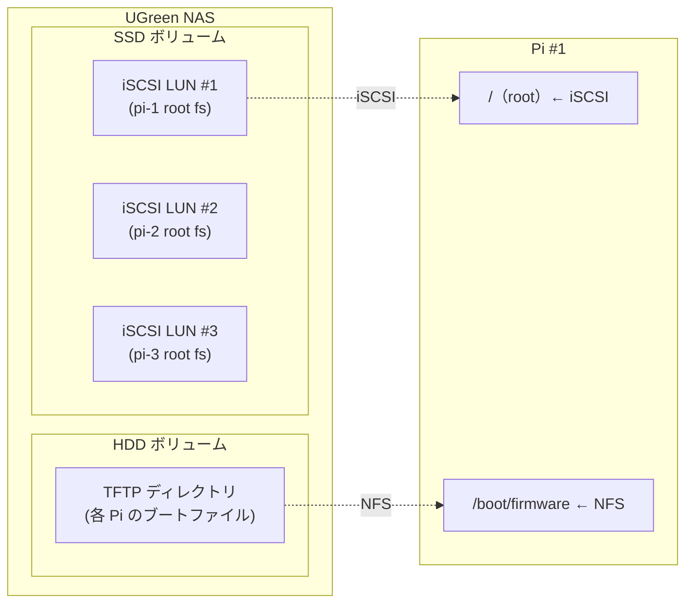
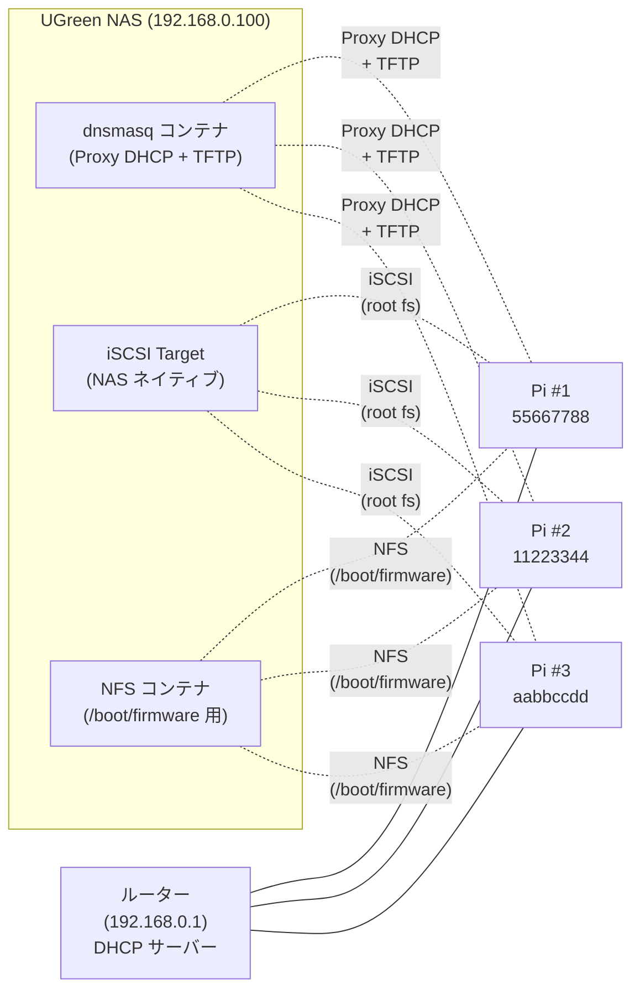
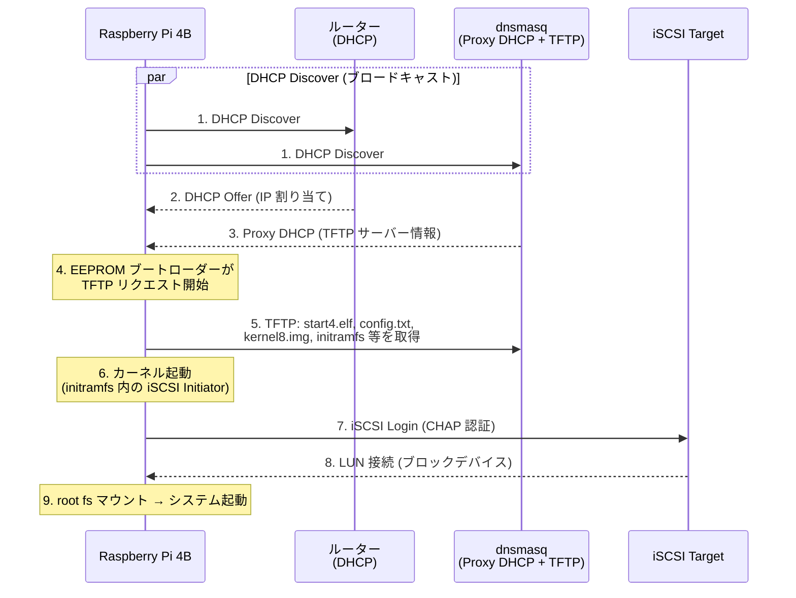

*令和最新版おうちサーバ（Raspberry Pi 4B × 3 + UGREEN の NAS × 1）<br />牛のぬいぐるみは母校である宮崎大学のマスコットキャラクター「[みやだいもうくん](https://x.com/miyacoop/status/2027208975914353047)」*

こんにちは。[korosuke613](https://zenn.dev/korosuke613) です。最近おうちサーバにハマっています。Raspberry Pi 4B 3 台と UGREEN の NAS で色々動かしています。

とても楽しいおうちサーバですが、何も考えずに Raspberry Pi 4B を 3 台運用していると、SD カードの突然死に怯える日々を送ることになります。また、とりあえず外付け HDD を USB 接続したとしても、うまくやらないと接触不良に悩まされたり、電源の用意がダルかったりします。

***「解放されたい...脆弱な SD カードから...micro USB 3.0 Type-B ケーブルから...」***

そんな思いから、本記事では SD カード、USB ケーブル接続の外付け HDD/SSD を完全に排除し、LAN ケーブルを経由した **PXE（Preboot Execution Environment）と iSCSI を組み合わせたネットワークブート**で Raspberry Pi 4B を運用する構成の備忘録をまとめます。

NAS の SSD 上に root ファイルシステムを配置し、ネットワーク経由でブートさせることで、不安定な運用から解放されることを目指します。

:::message
本記事は筆者の環境で実際に構築した際の記録です。本記事の手順がそのまま適用できるとは限りません。参考程度にしてください。
:::

# ネットワークブートに至った理由

## SD カードの何が問題なのか

Raspberry Pi の標準的なブートメディアである SD カードには、次の課題があります。

- **書き込み寿命**: フラッシュメモリの書き込み回数には上限がある。ログ出力や一時ファイルの書き込みが積み重なると、数ヶ月〜数年で寿命を迎えることがある
- **停電時の破損リスク**: 書き込み中の突然の電源断で、ファイルシステムが破損して起動不能になることがある

単なるパソコンとして使うならあまり問題にならないかもしれませんが、サーバー用途で 24 時間稼働させる場合は、SD カードの寿命と信頼性の問題が非常に大きくなります。定期的なバックアップや交換が必要になりますが、手間もコストもかかります。

僕は大学の頃そこら辺がよくわかっておらず、研究室に置いた常時起動 Raspberry Pi を 3 回くらい突然死させています。

## 外付け HDD/SSD はどうか

SD カードの課題を受けて、そこら辺に転がっていた外付け HDD に OS を入れて USB 接続（micro USB 3.0 Type-B）して運用していました。しかし、micro USB 3.0 Type-B の接続不良が発生しやすく、Pi を移動するたびにケーブルが抜けるリスクがありました。各 Pi に HDD とケーブルがぶら下がる状態も取り回しが悪く、長期運用には向いていませんでした。

NVMe で SSD を直接接続することも検討しましたが、Raspberry Pi 4B で NVMe を利用するには NVMe HAT と SSD を追加購入する必要があり、3 台分のコストを考えて見送りました。

そんな中、クラウドのデータバックアップ用に NAS を導入したところ、iSCSI Target 機能が搭載されていることに気づきました。「NAS をストレージとしてネットワークブートするのはどうか？」と思いつき、構築に着手しました。

## ネットワークブートの利点

ネットワークブートとは、ローカルのストレージデバイスではなく、ネットワーク経由でサーバーから OS を読み込んで起動する方式です。ストレージをサーバーに集約できるため、次のような利点があります。

- **NAS での集中管理**: 全ノードのブートファイルと root ファイルシステムを NAS 上で一元管理できる
- **ストレージの耐久性**: NAS に搭載した HDD や SSD は SD カードと比べて書き込み耐性が高く、寿命の心配が大幅に減る（たぶん）
- **周辺機器・ケーブルの削減**: USB ブートと比べて、各 Pi に USB ケーブルや外付けストレージを接続する必要がない。物理的な接続点が減ることで、ケーブル抜けや接触不良による障害リスクも下がる（LAN ケーブルの方が信頼できる）
- **ノード追加・交換が容易**: 新しい Pi を追加するとき、新たな記憶媒体（外付け HDD/SSD など）を追加で用意する必要がない。場所も電源も取らない。NAS 上に iSCSI ターゲットを作るだけで済む

# システム構成

本記事では、NAS を PXE サーバー兼 iSCSI Target として使い、3 台の Raspberry Pi 4B をネットワークブートする構成を構築します。各 Pi は電源と Ethernet ケーブルだけで起動し、OS の root ファイルシステムは NAS 上の iSCSI LUN から読み込みます。

## ネットワークブートの方式選定

ネットワークブートの root ファイルシステムには NFS と iSCSI の 2 つの選択肢があります。筆者は当初 NFS で運用していましたが、後に iSCSI へ移行しました。

| 項目 | iSCSI | NFS |
|---|---|---|
| アクセス方式 | ブロックデバイス | ファイル単位 |
| パフォーマンス | 高速（特にランダム I/O） | 中程度 |
| 複数ノードからの同時マウント | 不可（1 LUN = 1 ノード） | 可能 |
| 設定の複雑さ | やや複雑（initramfs 対応が必要） | シンプル |

iSCSI はブロックデバイスとして振る舞うため、OS から見ると物理ディスクと同じように扱えます。ext4 などのファイルシステムをそのまま載せられるため、NFS と比べてパフォーマンスが高いのが利点です。

実は最初は NFS によるネットワークブートを行ったのですが、パフォーマンスが悪く体験が良くなさすぎたため、iSCSI によるネットワークブートを行うことにしました[^nfs_vs_iscsi]。

以降の構築手順は iSCSI ベースの構成で進めます。

[^nfs_vs_iscsi]: NFS ベースの Pi と iSCSI ベースの Pi でそれぞれ UnixBench を実行したところ、iSCSI の方が総合スコアで約 23% 高い結果が出ました。

## 構成機器

| 役割 | 機器 | 備考 |
|---|---|---|
| NAS / iSCSI Target + PXE サーバー | UGreen NAS (192.168.0.100) | Docker で dnsmasq を稼働、iSCSI Target は NAS ネイティブ |
| ノード 1 (pi-1) | Raspberry Pi 4B | シリアル: `55667788` |
| ノード 2 (pi-2) | Raspberry Pi 4B | シリアル: `11223344` |
| ノード 3 (pi-3) | Raspberry Pi 4B | シリアル: `aabbccdd` |
| ルーター | 既存のホームルーター (192.168.0.1) | DHCP サーバー兼用 |

:::message
**本記事の IP アドレス・MAC アドレス・シリアル番号について**
本記事に記載している IP アドレス、MAC アドレス、シリアル番号はすべてダミー値です。実際の環境に合わせて読み替えてください。
:::

## ストレージ構成

NAS 内部のストレージ配置と、Pi のマウント先の対応関係を示します（代表として Pi #1 のみ記載）。



## ネットワーク・サービス構成

NAS 上で動作するサービスと、各 Pi・ルーターとのネットワーク接続関係を示します。



:::message
**NFS サーバーの役割 ── なぜ `/boot/firmware` は iSCSI ではないのか**
root ファイルシステムは iSCSI 経由ですが、`/boot/firmware` は NFS でマウントしています。

iSCSI LUN は NAS から見ると生のブロックデバイスであり、中のファイルシステムにはアクセスできません。TFTP サーバー（dnsmasq）はブートファイルを NAS のファイルシステム上のディレクトリから配信するため、iSCSI LUN 内にブートファイルを置いても TFTP で配信できないのです。

そこで、TFTP ディレクトリを NFS エクスポートし、Pi の `/boot/firmware` としてマウントしています。Raspberry Pi OS で `apt upgrade` によりカーネルがアップデートされると、新しいカーネルイメージ（`kernel8.img`）や initramfs は `/boot/firmware` に書き込まれます。これが NFS 経由で TFTP ディレクトリに直接反映されるため、次回起動時から更新後のカーネルで自動的に起動します。
:::

## ブートシーケンス

電源 ON からシステム起動までの流れを示します。



電源 ON 後、EEPROM ブートローダーがまずルーターから IP アドレスを取得し、dnsmasq の Proxy DHCP から TFTP サーバーの情報を受け取ります。EEPROM ブートローダーが TFTP で start4.elf 等のファームウェアを取得した後、カーネルと initramfs をロードします。initramfs 内の iSCSI Initiator が iSCSI Target に接続し、LUN を root ファイルシステムとしてマウントします。

# セットアップ（NAS）

UGreen NAS にはネイティブの Docker 機能が搭載されているため、dnsmasq（Proxy DHCP + TFTP）と NFS サーバーを Docker Compose で管理しています。一方、iSCSI Target は NAS のネイティブ機能として動作しており、Docker とは独立しています。

NAS 上で動作させるサービスは次の 2 つです。

- **dnsmasq**（Proxy DHCP + TFTP サーバー）: PXE クライアントにブートサーバー情報を配信し、TFTP でブートファイルを提供する。
- **NFS サーバー**: 各 Pi のシリアル番号ディレクトリを NFS エクスポートする。

:::details docker-compose.yaml の全体。

```yaml:docker-compose.yaml
services:
    dnsmasq:
        image: strm/dnsmasq:latest
        container_name: dnsmasq-proxydhcp
        network_mode: host
        cap_add:
        - NET_ADMIN
        - NET_RAW
        environment:
        - TZ=Asia/Tokyo
        command:
        - "--conf-file=/config/dnsmasq.conf"
        - "--keep-in-foreground"
        - "--log-facility=-"
        volumes:
        - ./config:/config
        - ./tftproot:/tftproot
        restart: unless-stopped

    nfs-server:
        image: erichough/nfs-server:2.2.1
        container_name: nfs-server-raspberry
        restart: unless-stopped
        privileged: true
        environment:
        - NFS_EXPORT_0=/nfsshare/tftproot/aabbccdd 192.168.0.101(rw,async,no_subtree_check,no_root_squash,insecure)
        - NFS_EXPORT_1=/nfsshare/tftproot/11223344 192.168.0.102(rw,async,no_subtree_check,no_root_squash,insecure)
        - NFS_EXPORT_2=/nfsshare/tftproot/55667788 192.168.0.103(rw,async,no_subtree_check,no_root_squash,insecure)
        volumes:
        - ./tftproot/aabbccdd:/nfsshare/tftproot/aabbccdd
        - ./tftproot/11223344:/nfsshare/tftproot/11223344
        - ./tftproot/55667788:/nfsshare/tftproot/55667788
        network_mode: host
```
:::

:::message
**`no_root_squash` のセキュリティに関する注意**
NFS エクスポートに `no_root_squash` を指定すると、リモートの root ユーザーがサーバー上のファイルに root 権限でアクセスできます。PXE ブートの root ファイルシステム提供には必要ですが、信頼できるネットワーク内でのみ使用してください。
:::


## dnsmasq 設定

dnsmasq を **Proxy DHCP** モードで動作させます。

```bash:config/dnsmasq.conf
# DNS無効（ルーターのDNSを使用）
port=0
local-service

interface=eth0
bind-interfaces

# PXEサーバのホスト名/IPアドレス登録
host-record=raspberrypi-pxe,192.168.0.100

# 既存DHCPと併用するProxy DHCP
dhcp-range=tag:raspberrypi-pxe,192.168.0.100,proxy

# PXEクライアントのバグ対策（Pi 3 の既知の PXE ブート問題 https://github.com/raspberrypi/firmware/issues/934 への回避策。
# Pi 4B でもこの設定がないとブートループに陥ったため入れている）
dhcp-reply-delay=2

# GWとDNS
dhcp-option=option:router,192.168.0.1
dhcp-option=option:dns-server,192.168.0.1

# Raspberry Pi ブートローダーに PXE ブートサービスの存在を知らせる設定
# type=0 は dnsmasq の仕様上「ローカルブート」だが、Raspberry Pi の PXE 実装は type を無視するため 0 でも動作する
pxe-service=tag:raspberrypi-pxe,0,"Raspberry Pi Boot"

# Raspberry Pi 特定（MACアドレス設定）
dhcp-host=dc:a6:32:xx:xx:01,set:raspberrypi-pxe  # pi-3
dhcp-host=dc:a6:32:xx:xx:02,set:raspberrypi-pxe  # pi-2
dhcp-host=dc:a6:32:xx:xx:03,set:raspberrypi-pxe  # pi-1

# TFTP boot設定
dhcp-boot=,,192.168.0.100

# TFTP を dnsmasq で提供
enable-tftp
tftp-root=/tftproot
tftp-no-fail

log-dhcp
```

:::message
**Proxy DHCP とは**
Proxy DHCP は、既存の DHCP サーバー（ルーター）と共存するための仕組みです。IP アドレスの割り当ては既存の DHCP サーバーに任せ、PXE ブートに必要な情報（TFTP サーバーのアドレスやブートファイルパス）だけを追加で配信します。`port=0` で DNS 機能を無効化し、`dhcp-range` に `proxy` を指定することで Proxy DHCP モードになります。

`dhcp-reply-delay=2` は、Raspberry Pi の PXE クライアントのファームウェアバグを回避するための設定です。この遅延がないとブートループに陥る場合があります。元々は Pi 3 で報告されたバグですが、Pi 4B でも同様の挙動が発生したため設定しています。
:::

## iSCSI ターゲット

UGreen NAS にはネイティブの iSCSI Target 機能が搭載されているため、これを利用しています。

設定の要点は次の通りです。

- **Target IQN**: `iqn.2025-03.com.ugreen:target-1.xxxxx`（各 Pi 用に LUN を作成）
- **LUN サイズ**: 各 32GB[^lun_size]
- **CHAP 認証**: ユーザー名とパスワードを設定（任意だがセキュリティ上推奨）
- **ACL**: 接続許可する Initiator IQN を設定

[^lun_size]: 適当。永続化したいデータは NAS の共有フォルダに保存予定なので OS その他ミドルウェア等のみ入れる想定。

# セットアップ（Raspberry Pi）

ここからが本記事の核心部分です。

## 1. ネットワークブートの有効化

Raspberry Pi 4B でネットワークブートを有効にするには、SPI EEPROM のブートローダー設定を変更します[^eeprom-boot]。Pi 4B は **EEPROM 内のブートローダー** でブート順序を制御します。EEPROM なので何度でも設定変更可能です。

[^eeprom-boot]: [Raspberry Pi Documentation - Raspberry Pi hardware](https://www.raspberrypi.com/documentation/computers/raspberry-pi.html)

```bash
sudo -E rpi-eeprom-config --edit
# BOOT_ORDER=0xf21 に設定
```

`BOOT_ORDER` は右から順に試行するブートモードを 16 進数で並べたものです[^boot-order]。よく見る各桁の意味は次の通りです。

| 値 | ブートモード |
|---|---|
| `1` | SD カード |
| `2` | ネットワーク（PXE） |
| `4` | USB マスストレージ |
| `6` | NVMe |
| `f` | 再起動してリトライ |

`0xf21` の場合、右から `1`（SD カード）→ `2`（ネットワーク）→ `f`（リトライ）の順に試行します。SD カードが見つからなければネットワークブートにフォールバックし、それでもダメなら再起動してリトライします。

[^boot-order]: [Raspberry Pi Documentation - BOOT_ORDER](https://www.raspberrypi.com/documentation/computers/raspberry-pi.html#BOOT_ORDER)

## 2. iSCSI LUN への OS 書き込み

適当な Linux マシンから iSCSI LUN に接続し、Raspberry Pi OS を書き込みます。

```bash
# iSCSI 接続（CHAP 認証ありの場合）
sudo iscsiadm -m discovery -t st -p 192.168.0.100
sudo iscsiadm -m node \
    -T iqn.2025-03.com.ugreen:target-1.xxxxx \
    -p 192.168.0.100 \
    --op update -n node.session.auth.authmethod -v CHAP
sudo iscsiadm -m node \
    -T iqn.2025-03.com.ugreen:target-1.xxxxx \
    -p 192.168.0.100 \
    --op update -n node.session.auth.username -v <ユーザー名>
sudo iscsiadm -m node \
    -T iqn.2025-03.com.ugreen:target-1.xxxxx \
    -p 192.168.0.100 \
    --op update -n node.session.auth.password -v <パスワード>
sudo iscsiadm -m node \
    -T iqn.2025-03.com.ugreen:target-1.xxxxx \
    -p 192.168.0.100 --login

# iSCSI LUN のデバイスファイルを確認
# 接続後に追加されたデバイスを lsblk で確認する（今回は /dev/sdc でした。間違い注意！）
lsblk

# Raspberry Pi OS イメージを書き込み
# GUI 不要なので arm64 の Lite 版を使用
sudo dd if=raspios-bookworm-arm64-lite.img of=/dev/sdc bs=4M status=progress

# パーティションテーブル再読み込み
sudo partprobe /dev/sdc

# パーティション構成を確認
# Raspberry Pi OS のイメージは 2 パーティション構成:
#   /dev/sdc1 = boot（/boot/firmware）
#   /dev/sdc2 = root（/）
lsblk /dev/sdc

# パーティション 2（root）を LUN 全体に拡張
sudo growpart /dev/sdc 2
sudo e2fsck -f /dev/sdc2
sudo resize2fs /dev/sdc2
```

## 3. iSCSI 対応 initramfs の生成

通常の Raspberry Pi OS の initramfs[^initramfs] には iSCSI Initiator が含まれていません。chroot 環境で open-iscsi をインストールし、iSCSI 対応の initramfs を生成する必要があります。

:::message
**chroot 先は ARM64 の rootfs です。** x86_64 マシンで作業する場合は `qemu-user-static` と `binfmt_misc` を設定して ARM64 バイナリを実行できるようにしておく必要があります。別の Raspberry Pi や ARM64 Linux マシン上で作業する場合はそのまま chroot できます。
:::

[^initramfs]: initramfs（initial RAM filesystem）は、カーネル起動直後にメモリ上に展開される一時的なファイルシステムです。本来の root ファイルシステムをマウントするために必要なドライバやツールを格納しています。iSCSI ブートの場合、ネットワーク接続と iSCSI ログインを initramfs の段階で行う必要があるため、iSCSI 関連ツールを組み込んだ initramfs を生成します。

```bash
# iSCSI LUN のマウント
sudo mkdir -p /mnt/pi-root
sudo mount /dev/sdc2 /mnt/pi-root

# chroot 環境の準備
sudo mount --bind /proc /mnt/pi-root/proc
sudo mount --bind /sys /mnt/pi-root/sys
sudo mount --bind /dev /mnt/pi-root/dev
sudo mount --bind /dev/pts /mnt/pi-root/dev/pts

# chroot 実行
sudo chroot /mnt/pi-root

# open-iscsi と initramfs-tools をインストール
apt update
apt install --reinstall open-iscsi initramfs-tools

# このファイルが存在すると、initramfs 起動時に cmdline の iSCSI パラメータを読み取って自動接続する
# 中身は空でよい（フラグファイル）。詳細: https://sources.debian.org/src/open-iscsi/2.0.874-7.1/debian/README.Debian/
mkdir -p /etc/iscsi
touch /etc/iscsi/iscsi.initramfs

# SSH を有効化（ヘッドレス運用のため）
systemctl enable ssh

# ユーザー作成とパスワード設定
# Bullseye（2022 年 4 月アップデート）以降はデフォルトの pi ユーザーが存在しないため、手動で作成する
# ユーザー名とパスワードはお好みで
useradd -m -G sudo -s /bin/bash pi
echo 'pi:<パスワード>' | chpasswd

# chroot 内のカーネルバージョンを確認
# （uname -r はホスト側のカーネルバージョンを返すため注意）
ls /lib/modules/

# 確認したバージョンを指定して initramfs を再生成
update-initramfs -v -k <確認したバージョン> -c

# 生成確認
ls -la /boot/initrd.img-*

# chroot 終了
exit
```

生成された initramfs は後述の TFTP ディレクトリにコピーします。これで Pi が PXE ブート時に iSCSI 接続できる initramfs が準備できました。

## 4. TFTP ディレクトリ構成

Raspberry Pi 4B は起動時に自身のシリアル番号をディレクトリ名として TFTP サーバーにリクエストします。各 Pi のシリアル番号に対応したディレクトリを作成し、ブートファイルを配置します。

ここでの `tftproot/` は NAS 上の共有フォルダであり、dnsmasq の `tftp-root` で指定したディレクトリです。このディレクトリは NFS でもエクスポートしており、Pi の `/boot/firmware` としてマウントされます（[セットアップ（NAS）](#セットアップ（nas）)参照）。

ブートファイルは iSCSI LUN に書き込んだ Raspberry Pi OS のブートパーティションから取得できます。

```bash
# /nfsshare/tftproot/ は NAS の共有フォルダをマウント済みの前提です
# Pi 固有のディレクトリ作成
mkdir -p /nfsshare/tftproot/<シリアル番号>

# iSCSI LUN のブートパーティション（/dev/sdc1）をマウント
sudo mount /dev/sdc1 /mnt/pi-root/boot/firmware

# ブートファイルを丸ごとコピー（iSCSI LUN のブートパーティションから）
# セクション 3 で生成した iSCSI 対応 initramfs（initramfs8）も含まれる
cp -r /mnt/pi-root/boot/firmware/* /nfsshare/tftproot/<シリアル番号>/
```

最終的なディレクトリ構成は次のようになります（config.txt と cmdline.txt は後述のセクションで作成）。

```
tftproot/
├── aabbccdd/          ← Pi #3 固有ディレクトリ
│   ├── start4.elf
│   ├── fixup4.dat
│   ├── kernel8.img
│   ├── initramfs8     ← iSCSI 対応 initramfs
│   ├── config.txt
│   ├── cmdline.txt
│   ├── *.dtb
│   └── overlays/
├── 11223344/          ← Pi #2
└── 55667788/          ← Pi #1
```

:::message
私の場合は `/boot/firmware/` を丸ごとコピーしましたが、最低限必要なのは `start4.elf`、`fixup4.dat`、`kernel8.img`、`*.dtb`、`overlays/` のようです[^tftp-files]。どなたか試してみてください。

[^tftp-files]: [Network Booting a Raspberry Pi 4 - BitBanged](https://bitbanged.com/posts/streamlining-rpi-osdev/network-booting-a-raspberry-pi-4/)
:::

## 5. config.txt

`config.txt` で `auto_initramfs=1` を指定することで、TFTP ディレクトリ内の initramfs を自動的にロードします。ファームウェアはカーネルファイル名から対応する initramfs ファイル名を自動推定します（例: `kernel8.img` → `initramfs8`）[^auto-initramfs]。Raspberry Pi OS の `update-initramfs` はカーネルフックによって `/boot/firmware/initramfs8` を自動生成するため、前セクションの `boot/firmware/*` の一括コピーで対応できます。

[^auto-initramfs]: [Raspberry Pi Documentation - config.txt](https://www.raspberrypi.com/documentation/computers/config_txt.html)

```ini:tftproot/<シリアル番号>/config.txt
# GPU メモリ最小化（GUI を使わないため）
gpu_mem=16

# initramfs の自動ロード（iSCSI ブートに必須）
auto_initramfs=1

[all]
```

## 6. cmdline.txt

`cmdline.txt` にはカーネルパラメータとして iSCSI の接続情報を記述します。**全パラメータを 1 行で記述する必要があります。**

```text:tftproot/<シリアル番号>/cmdline.txt
ip=::::pi-1:eth0:dhcp ISCSI_INITIATOR=iqn.1993-08.org.debian:01:rpi4-<シリアル番号> ISCSI_TARGET_IP=192.168.0.100 ISCSI_TARGET_PORT=3260 ISCSI_TARGET_NAME=iqn.2025-03.com.ugreen:target-1.<ターゲットID> ISCSI_USERNAME=<ユーザー名> ISCSI_PASSWORD=<パスワード> root=UUID=<rootパーティションのUUID> rw rootwait cgroup_memory=1 cgroup_enable=memory cgroup_enable=cpuset
```

各パラメータの説明は次の通りです。

| パラメータ | 説明 |
|---|---|
| `ip=::::pi-1:eth0:dhcp` | DHCP でネットワーク設定を取得。ホスト名を指定 |
| `ISCSI_INITIATOR` | この Pi の iSCSI Initiator IQN。シリアル番号を含めて一意にする |
| `ISCSI_TARGET_IP` | iSCSI Target サーバー（NAS）の IP アドレス |
| `ISCSI_TARGET_PORT` | iSCSI ポート（標準: 3260） |
| `ISCSI_TARGET_NAME` | iSCSI Target の IQN |
| `ISCSI_USERNAME` / `ISCSI_PASSWORD` | CHAP 認証情報（CHAP を使わない場合は省略可だが使った方が良さそう） |
| `root=UUID=...` | iSCSI LUN 内の root パーティションの UUID[^uuid] |
| `rw rootwait` | root を読み書き可能でマウント。デバイス準備完了まで待機 |
| `cgroup_memory=1` 等 | cgroup 設定（k8s 動かすのに必要） |

:::message
**iSCSI パラメータの大文字・小文字について**
open-iscsi の initramfs スクリプトは本来小文字のパラメータ名（`iscsi_initiator` 等）をパースします。本記事では大文字で記述していますが、環境によっては小文字でないと認識されない場合があります。動作しない場合は小文字に変更してください。
:::

[^uuid]: iSCSI LUN に接続した状態で `blkid /dev/sdc2` を実行して確認できます。cmdline.txt の UUID と一致しないと root マウントに失敗します。

## 7. fstab

iSCSI LUN 内の `/etc/fstab`[^fstab] を設定します。Raspberry Pi OS のデフォルトの fstab は SD カード前提になっているため、iSCSI + NFS の構成に合わせて書き換える必要があります。

[^fstab]: fstab（file systems table）は、起動時に自動マウントするファイルシステムの一覧を定義するファイルです。各行に「どのデバイスを」「どこに」「どの形式で」マウントするかを記述します。

```bash:iSCSI LUN 内の /etc/fstab
# デフォルトのまま
proc /proc proc defaults 0 0

# root ファイルシステム（iSCSI 経由）
UUID=<rootパーティションのUUID> / ext4 defaults,noatime,_netdev 0 1

# /boot/firmware（NFS 経由で TFTP ディレクトリをマウント）
192.168.0.100:/nfsshare/tftproot/<シリアル番号> /boot/firmware nfs defaults,vers=3,proto=tcp,_netdev 0 2

# パフォーマンス向上のための RAM ディスク（お好みで）
tmpfs /tmp tmpfs defaults,size=100M 0 0
tmpfs /var/tmp tmpfs defaults,size=50M 0 0
tmpfs /var/log tmpfs defaults,size=50M 0 0
```

`_netdev` オプションが重要です。このオプションを指定すると、ネットワークが利用可能になるまでマウントを待機します。iSCSI や NFS のように、ネットワーク経由でアクセスするファイルシステムにはこのオプションが必須です。

`tmpfs` で `/tmp`、`/var/tmp`、`/var/log` を RAM ディスクに配置しています。これにより、頻繁な書き込みがネットワーク I/O を発生させず、パフォーマンスが向上します。ただし、再起動するとログが消えるため、永続化が必要な場合は別途対策が必要です。また、指定した `size` を超えると書き込みが失敗するため、`logrotate` や `journald` の `SystemMaxUse` でログサイズを制限しておくことを推奨します。

# 動作確認

果たしてちゃんと起動するのか？動作確認です。

1. Raspberry Pi 4B の SD カードスロットが空であることを確認
2. Ethernet ケーブルを接続
3. 電源を投入

Pi に SSH できればネットワークブート自体は成功していると言えるでしょう。

```bash
# SSH で Pi に接続
ssh pi@<Pi の IP アドレス>
```

あとは iSCSI セッションが確立されていることや、root ファイルシステムが iSCSI LUN からマウントされてそうかを見ると間違いないでしょう。

```console:SSH 接続後の確認実行例
# iSCSI セッション確認
$ sudo iscsiadm -m session
tcp: [1] 192.168.0.100:3260,1 iqn.2025-03.com.ugreen:target-1.<ターゲットID> (non-flash)

# ファイルシステム確認
$ df -h /
Filesystem      Size  Used Avail Use% Mounted on
/dev/sda2        31G  2.1G   28G   7% /

# ディスク情報
$ lsblk
NAME   MAJ:MIN RM  SIZE RO TYPE MOUNTPOINTS
sda      8:0    0   32G  0 disk
├─sda1   8:1    0  512M  0 part
└─sda2   8:2    0 31.5G  0 part /
```


# 運用してみて

PXE + iSCSI 構成に移行してから数ヶ月が経過した時点での所感をまとめます。

**HDD でやったら音がうるさすぎたので SSD に変更した**

当初は NAS の HDD 上に iSCSI LUN を配置していましたが、Pi が常時稼働しているため HDD の読み書き音が途切れることなく発生し、生活空間に置くには厳しい状態でした。そこで、NAS に搭載していた R/W キャッシュ用 SSD 2 枚のうち 1 枚を R キャッシュ専用に、もう 1 枚をストレージボリュームとして転用し、iSCSI LUN の配置先を SSD に変更しました。結果として、読み書き音の頻度が大幅に減り、パフォーマンスも向上しました。

**良かった点**

いくつかあります。

- **SD カードの心配から解放された**: SD カードの故障のしやすさを無視してよくなった
- **接続の信頼性向上**: USB HDD 運用時代は micro USB 3.0 Type-B の接触不良に悩まされていたが、ネットワークブートでは Ethernet ケーブル（RJ45）のみで完結する。RJ45 はラッチ付きで抜けにくく、接続の信頼性が格段に高い
- **集中管理の恩恵**: OS のアップデートやバックアップを NAS 側で一元管理できるため、3 台個別に SD カードを抜き差しする必要がない

**微妙だった点**

一方で、この構成には **NAS とスイッチングハブが単一障害点（SPOF）になる** という明確なデメリットがあります。

- **NAS が停止した場合**: iSCSI Target と TFTP/NFS がすべて NAS 上で動作しているため、NAS がダウンすると全 Pi が起動不能になる。稼働中の Pi も root ファイルシステムにアクセスできなくなり、事実上停止する
- **スイッチングハブが故障した場合**: ネットワーク経由でのブートと root ファイルシステムアクセスの両方が断たれるため、同様に全 Pi が停止する

SD カードでは各 Pi が独立して動作できていたことを考えると、必ずしも SD カードより信頼性が高いとは言い切れない部分もあります。とりあえず面倒なのは NAS の OS アプデなどで再起動したい場合ですね。再起動前にちゃんと Pi と k3s クラスタを綺麗にシャットダウンしなければいけません。

**今後やりたいこと**
やっぱり現状 NAS とスイッチングハブが SPOF になっているのが気になるので、将来的には冗長化も検討したいところですね。一台くらい SSD 搭載のミニ PC かなんかを用意して、k3s クラスタのコントロールプレーンにしたら少なくとも k3s クラスタはダウンタイムなしで運用できそうです。まあ自宅用途なのでそこまでするかは微妙ですが。

あと、各 Pi は Ethernet ケーブルと電源ケーブルの 2 本が接続されています。PoE（Power over Ethernet）対応のスイッチングハブを導入すれば、Ethernet ケーブル 1 本で電力供給とネットワーク接続の両方を賄えるため、電源ケーブルとアダプタを排除できます。めちゃくちゃスッキリしますね。
ただし、Raspberry Pi 4B は標準では PoE に対応していないため、別途 PoE HAT（拡張ボード）を各 Pi に装着する必要があります。PoE HAT 3 つと PoE 対応スイッチングハブを用意するとちょっとお金が必要になりますね。メモリ買うよりよっぽど安いけど。

# おわりに

Raspberry Pi 4B を PXE + iSCSI でネットワークブートする構成と構築手順を紹介しました。前からやりたかったんですよね。SD カードも、USB ストレージも不要で、すっきりした構成で運用できて満足しています。

今回これをやるために先駆者を探したのですが、Raspberry Pi 4B で iSCSI ブートしている事例がほとんど見つからず、情報が断片的で苦労しました。とはいえがんばってくれたのは AI でした。AI 便利すぎる。

皆さんもネットワークブートしてみてください。

:::message
**おまけ：動かしているもの**

サーバ群の上では k3s クラスタが稼働しており、さまざまなワークロードを動かしています。最近は AI もいるおかげで何でもかんでも自作できていいですね。

- アプリケーション
  - **Home Assistant**: ホームオートメーション
  - **AdGuard Home**: ネットワーク全体の DNS / 広告ブロック
  - **Glance**: セルフホストダッシュボード
  - **time-news-service**: 時報・ニュース読み上げ（自作）
  - **gh-cron-trigger**: GitHub Actions ワークフローの定期実行（自作）[^alt_cronium]
  - **vitalbridge**: Apple ヘルスケアのデータを受け取って VictoriaMetrics に投げる webhook（自作）
  - **smartmeter-service**: スマートメーターから B ルート経由で家の電力使用量を取得し、VictoriaMetrics に投げるシステム（自作）
- クラスタ基盤
  - **Flux CD**: GitOps によるデプロイ管理
  - **Cloudflare Tunnel**: 外部からの HTTPS アクセス
  - **external-dns**: Cloudflare Tunnel 用の Cloudflare DNS レコード管理
  - **ingress-nginx**: ローカルネットワークからの HTTPS アクセス
  - **cert-manager**: ローカルネットワーク向け HTTPS 証明書の発行
  - **nfs-provisioner**: NAS の共有フォルダを Persistent Volume として利用
  - **Grafana Alloy + kube-state-metrics**: Grafana Cloud へのメトリクス送信
  - **Headlamp**: クラスタダッシュボード

[^alt_cronium]: cronium という GitHub Actions ワークフローを外部から定期実行する仕組みを真似したもの。参考：[GitHub Actions の定期実行ワークフローを「時間通り」に実行する](https://zenn.dev/cybozu_ept/articles/run-github-actions-scheduled-workflows-on-time)
:::
