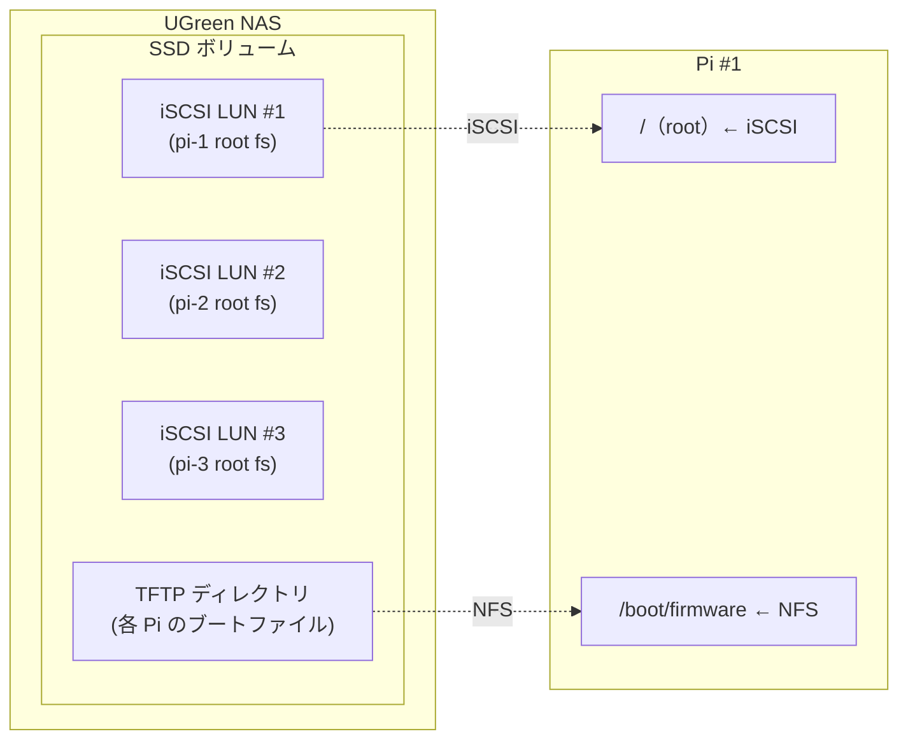

# Plan: Raspberry Pi PXE + iSCSI 記事レビュー修正（第 3 ラウンド）

## Context

記事 `articles/raspberry-pi-pxe-iscsi-boot.md` の第 3 ラウンドレビューで 6 つの修正点が指摘された。config.txt のデフォルト設定削除、ストレージ構成図の追加、PoE 今後の課題追加、private リポジトリの扱い修正、冒頭の写真 TODO 追加を行う。

## 対象ファイル

- `articles/raspberry-pi-pxe-iscsi-boot.md`

## 修正一覧

### 1. config.txt からデフォルト設定を削除（L386-405 付近）

DRM VC4 V3D、64bit モード、CPU ブーストの 3 つを config.txt コードブロックから削除。コードブロック直後の説明段落（`dtoverlay=vc4-kms-v3d` と `max_framebuffers=2` は〜）も削除。

**修正後の config.txt コードブロック**:
```ini
# GPU メモリ最小化（CLI 専用の場合）
gpu_mem=16

# initramfs の自動ロード（iSCSI ブートに必須）
auto_initramfs=1

[all]
```

### 2. 冒頭に写真 TODO を追加（L9「# はじめに」直後）

`# はじめに` の直後に `:::message alert` で TODO コメントを挿入。

```markdown
:::message alert
**TODO**: 実際のサーバー（Raspberry Pi + NAS）の写真をここに貼る
:::
```

### 3. ストレージ構成図を追加（「## ハードウェア」セクション内、ダミー値注意書きの後）

物理機器とその上の論理ストレージの関係を mermaid 図で追加。



### 4. GitHub リポジトリリンクの修正（L17-19, L543-544）

2 箇所で「公開しています」→「管理しています（非公開）」に変更。

**はじめに（L17-19）**:
- 変更前: `構成ファイル一式はリポジトリで公開しています。`
- 変更後: `構成ファイル一式は GitHub リポジトリで管理しています（非公開）。`

**まとめ（L543-544）**:
- 変更前: `構成一式はリポジトリで公開しています。`
- 変更後: `構成一式は GitHub リポジトリで管理しています（非公開）。`

### 5. 「今後の課題」セクション追加（「# まとめ」の直前、「# 運用してみて」の末尾）

「運用してみて」セクション内に「## 今後の課題」サブセクションを追加し、PoE 対応について記載。

```markdown
## 今後の課題

現在、各 Pi には Ethernet ケーブルと電源ケーブルの 2 本が接続されています。PoE（Power over Ethernet）対応のスイッチングハブを導入すれば、Ethernet ケーブル 1 本で電力供給とネットワーク接続の両方を賄えるため、電源ケーブルとアダプタを排除できます。

ただし、Raspberry Pi 4B は標準では PoE に対応していないため、別途 PoE HAT（拡張ボード）を各 Pi に装着する必要があります。PoE HAT と PoE 対応ハブの両方を揃える必要がありコストはかかりますが、ケーブル本数がさらに半減し、配線がよりシンプルになります。
```

### 6. config.txt セクション見出し周辺の説明調整

config.txt の説明文 `config.txt で auto_initramfs=1 を指定することで〜` はそのまま維持。デフォルト設定に関する言及がなくなるため、追加の説明は不要。

## 実行順序

1. config.txt デフォルト設定の削除 + 説明段落削除（#1）
2. 冒頭に写真 TODO 追加（#2）
3. ストレージ構成図追加（#3）
4. GitHub リポジトリリンク修正（#4）
5. 「今後の課題」セクション追加（#5）

## 検証

1. `pnpm exec textlint ./articles/raspberry-pi-pxe-iscsi-boot.md` で校正チェック
2. 記事構成の目視確認（新セクション・図の追加位置が正しいか）
3. `pnpm run start` でプレビューし mermaid 図の表示確認（任意）
